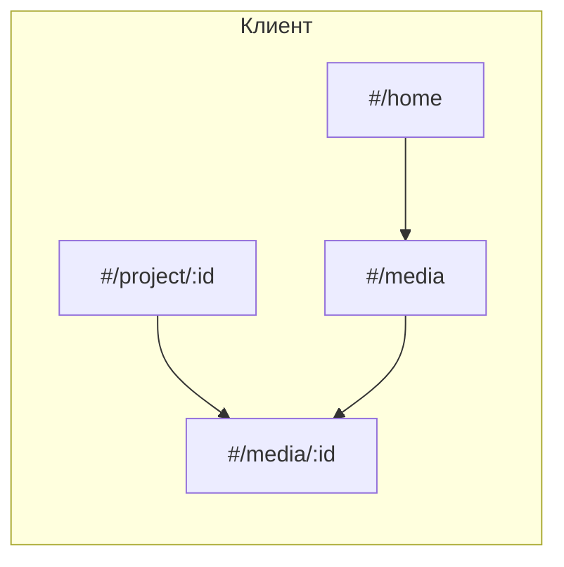

# Доступ клиента к медиа и комментариям

## Контекст

Сейчас [`server/src/routes/media.js`](c:/Users/eQurane/VSCode/mox/server/src/routes/media.js) для `GET /api/media` и `GET /api/media/:id` возвращает **`403`**, если `roleName === 'Клиент'`, хотя общая выборка уже ограничена членством в **`user_project`** (тот же паттерн, что у исполнителя): см. условие с `EXISTS (SELECT 1 FROM user_project …)` в этом же файле.

[`server/src/routes/comments.js`](c:/Users/eQurane/VSCode/mox/server/src/routes/comments.js): для **`GET`** комментарии запрещены для «Клиент» и «Внешний подрядчик»; для **`POST`** «Клиент» не входит в `ROLES_CAN_COMMENT`. Функция **`canSeeMedia`** уже проверяет членство в проекте для не‑менеджеров — её можно переиспользовать для клиента.

На фронте [`client/js/app.js`](c:/Users/eQurane/VSCode/mox/client/js/app.js) редирект на `#/home` блокирует **`#/media`** и **`#/media/:id`** только для **Клиента** (подрядчик по‑прежнему без глобального списка медиа — без изменений).

В [`client/js/pages/mediaDetail.js`](c:/Users/eQurane/VSCode/mox/client/js/pages/mediaDetail.js) флаг **`canComment`** не включает «Клиент», хотя после правок API форма комментариев должна заработать.

## Backend

1. **[`server/src/routes/media.js`](c:/Users/eQurane/VSCode/mox/server/src/routes/media.js)**  
   - Удалить ранний `403` для «Клиент» в **`GET /api/media`** и **`GET /api/media/:id`**.  
   - Не менять **`POST` / `PATCH` / `DELETE` / `replace`**: клиент по‑прежнему не в `ROLES_CAN_MODIFY` и не может загружать файлы.

2. **[`server/src/routes/comments.js`](c:/Users/eQurane/VSCode/mox/server/src/routes/comments.js)**  
   - **`GET`**: разрешить «Клиент»; для «Внешний подрядчик» оставить **`403`** (как сейчас по продуктовой логике).  
   - **`POST`**: добавить **`Клиент`** в `ROLES_CAN_COMMENT` (рядом с Админ / Менеджер / Исполнитель).  
   - Проверка видимости медиа через существующую **`canSeeMedia`** остаётся достаточной.

## Frontend

1. **[`client/js/app.js`](c:/Users/eQurane/VSCode/mox/client/js/app.js)**  
   - Разрешить маршруты **`#/media`** и **`#/media/:id`** для роли «Клиент».  
   - Оставить блокировку **`#/media`** для «Внешний подрядчик».

2. **[`client/js/nav/dashboardTabs.js`](c:/Users/eQurane/VSCode/mox/client/js/nav/dashboardTabs.js)**  
   - Показать вкладку **«Медиа»** для **Клиента** (ведёт на `#/media`, список уже ограничен сервером по проектам участия).  
   - **ТЗ** и **Коллекции** для клиента по‑прежнему скрыты; для подрядчика — без вкладки «Медиа» (как сейчас по смыслу ограничений).

3. **[`client/js/pages/projectDetail.js`](c:/Users/eQurane/VSCode/mox/client/js/pages/projectDetail.js)**  
   - Только для блока **«Мультимедиа»**: показать заголовок/кнопку перехода на **`#/media?projectId=…`** для **Клиента** (сейчас `hideGlobalBrowseLinks` скрывает и этот блок). ТЗ и коллекции для клиента не трогать.

4. **[`client/js/pages/mediaDetail.js`](c:/Users/eQurane/VSCode/mox/client/js/pages/mediaDetail.js)**  
   - Включить **`Клиент`** в **`canComment`**.  
   - Для удобства: кнопка «Назад» и сценарий ошибки загрузки — вести на **`#/project/:projectId`** (если известен `projectId`), иначе **`#/home`**, чтобы не отправлять клиента на глобальный список как единственный путь (по желанию можно оставить и `#/media`; предпочтительнее консистентность с карточкой проекта).

Другие страницы (**`taskDetail`**, **`collectionDetail`**) уже ведут на `#/media/:id`; после снятия блокировки роутера они заработают без обязательных правок.

## Документация (синхронизация)

Обновить несогласованные места:

- **[`.cursor/rules/access-matrix.mdc`](c:/Users/eQurane/VSCode/mox/.cursor/rules/access-matrix.mdc)** — секция роли «Клиент»: убрать утверждение о полном запрете списков медиа; описать **чтение** `GET /api/media`, `GET /api/media/:id` при членстве; **GET/POST** комментариев; обновить таблицы API/UI и описание **`ROLES_CAN_COMMENT`** (добавить Клиент).  
- **[`.cursor/rules/backend-api.mdc`](c:/Users/eQurane/VSCode/mox/.cursor/rules/backend-api.mdc)** — строки про **`GET /api/media`**, **`GET /api/media/:id`**, комментарии: Клиент **`✅`** / **`⚠️`** по тем же правилам, что исполнитель (членство), без загрузки/правки медиа.  
- **[`.cursor/rules/frontend-architecture.mdc`](c:/Users/eQurane/VSCode/mox/.cursor/rules/frontend-architecture.mdc)** — маршруты `#/media`, `#/media/:id`, вкладки шапки для клиента.

При необходимости одной строкой упомянуть изменение в **[`report/README.md`](c:/Users/eQurane/VSCode/mox/report/README.md)** только если там дублируется матрица доступа (посмотреть при правках).

## Проверка вручную

- Войти пользователем с ролью **Клиент**, участником проекта с медиа: открыть проект → карточка медиа → просмотр, комментарий отправляется и отображается.  
- Убедиться, что **нет** доступа к чужому `mediaId` (ожидается **404**).  
- Убедиться, что **POST /api/media**, **PATCH** описания и **DELETE** по-прежнему **403** для клиента.  
- Подрядчик: поведение списка медиа и комментариев без изменений (**403** на комментариях).
