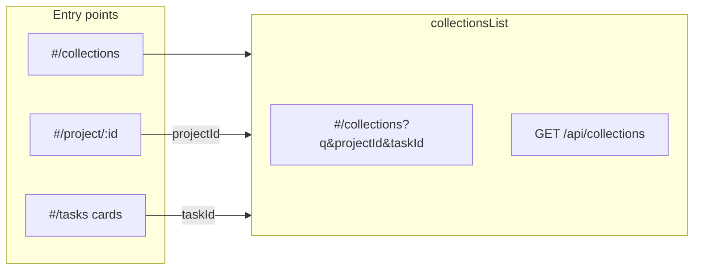

# Форма просмотра коллекций и диплинки

## Контекст

- Связь данных: **проект → задача (`tasks`) → коллекция (`collections`)** — см. [server/db_init/init.js](c:\Users\eQurane\VSCode\mox\server\db_init\init.js).
- Эталон UX/API: [server/src/routes/tasks.js](c:\Users\eQurane\VSCode\mox\server\src\routes\tasks.js) и [client/js/pages/tasksList.js](c:\Users\eQurane\VSCode\mox\client\js\pages\tasksList.js) (поиск, фильтры, `history.replaceState` в hash, шапка с вкладками из [client/js/nav/dashboardTabs.js](c:\Users\eQurane\VSCode\mox\client\js\nav\dashboardTabs.js)).
- В [client/js/app.js](c:\Users\eQurane\VSCode\mox\client\js\app.js) маршрута `collections` нет; таб уже ведёт на `#/collections` — сейчас это «Страница не найдена».

## 1. Backend: `GET /api/collections`

- Новый файл **[server/src/routes/collections.js](c:\Users\eQurane\VSCode\mox\server\src\routes\collections.js)** по образцу `tasks.js`:
  - **`requireAuth`**, `fetchRoleNameByUserId`, флаг `seeAll` для ролей **Админ** / **Менеджер**.
  - Условие видимости: та же схема, что у списка задач — для остальных ролей только коллекции, у которых `tasks.project_id` входит в проекты с активным `user_project` (`excluded_at IS NULL`).
  - **Query (все опционально):**
    - **`q`** — `ILIKE` по `collections.name` (экранирование шаблона как в `tasks.js`).
    - **`projectId`** — целое ≥ 1; `tasks.project_id = projectId`; неверный формат → **400**. Проект вне зоны видимости → **200** с пустым массивом (как у задач).
    - **`taskId`** — целое ≥ 1; `collections.task_id = taskId`; неверный формат → **400**. Задача вне зоны видимости → **200** с пустым массивом.
  - Если заданы **оба** `projectId` и `taskId`, применять **оба** условия (несовпадение даст пустой список).
  - **SELECT:** поля коллекции + join к `tasks` и `projects` для подписей в карточках:
    - `id`, `taskId`, `name`, `description`, `createdAt`, `lastEditedAt`, `projectId`, `projectName`, **`taskName`** (имя задачи).
  - **200:** `{ collections: [...] }` (camelCase как в [server/src/routes/projects.js](c:\Users\eQurane\VSCode\mox\server\src\routes\projects.js) для вложенных сущностей).
- Подключить роутер в **[server/src/server.js](c:\Users\eQurane\VSCode\mox\server\src\server.js)** (`app.use('/api', collectionsRouter)`).

## 2. Frontend: API и страница списка

- **[client/js/api/collections.js](c:\Users\eQurane\VSCode\mox\client\js\api\collections.js)** — `fetchCollections(filters)` по тому же паттерну, что [client/js/api/tasks.js](c:\Users\eQurane\VSCode\mox\client\js\api\tasks.js) (`URLSearchParams`, Bearer, русские тексты ошибок).
- **[client/js/pages/collectionsList.js](c:\Users\eQurane\VSCode\mox\client\js\pages\collectionsList.js)** — экспорт `renderCollectionsListPage(container, searchParams)`:
  - Разметка и поведение как у `tasksList`: `main.dashboard`, класс типа `collections-page` / переиспользование **`.tasks-page__header`**, **`.tasks-filters`** из [client/styles/main.css](c:\Users\eQurane\VSCode\mox\client\styles\main.css) (уже общие по смыслу), поиск с debounce ~300 ms, `syncHash` → `#/collections?...`.
  - Вкладки: `appendDashboardSectionTabs(nav, { active: 'collections', isAdmin })`.
  - После `fetchMe` / обновления сессии (как на задания).
  - **Фильтры:** текстовый `q`; селект **Проект** (`fetchProjects`); селект **Задания** — опции из **`fetchTasks({ projectId })`** когда выбран проект (если проект «Все» — селект задание пустой/заблокирован или одна опция «Все»). При смене проекта сбрасывать `taskId`, если выбранное задание не входит в новый список.
  - **Загрузка:** `Promise.all([fetchProjects(), fetchCollections(payload)])`; при необходимости догружать задачи для селекта при выбранном `projectId`.
  - **Карточка коллекции:** те же базовые классы, что у задачи (**`project-card project-card--static`**), плейсхолдер медиа; текст: название, описание, строки «Проект: …», «Задание: …», даты создания/изменения (как на [projectDetail.js](c:\Users\eQurane\VSCode\mox\client\js\pages\projectDetail.js) `buildCollectionCard`).
  - Диплинк **только `taskId`**: после первого ответа при наличии строк выставить `projectId` в селекте из `collections[0].projectId`, подтянуть задачи и выставить `taskId` (одна задача — все строки с одним `taskId`).

## 3. Роутинг и защита

- **[client/js/app.js](c:\Users\eQurane\VSCode\mox\client\js\app.js):**
  - В **`isProtectedRoute`**: для `segs[0] === 'collections' && segs.length === 1` → `true`.
  - В **`route()`**: ветка `if (segs[0] === 'collections' && segs.length === 1) { renderCollectionsListPage(appRoot, searchParams); return; }` (рядом с `tasks`).

## 4. Диплинки с экрана проекта и со списка заданий

- **[client/js/pages/projectDetail.js](c:\Users\eQurane\VSCode\mox\client\js\pages\projectDetail.js):**
  - Ввести `hrefCollectionsList = `#/collections?projectId=${encodeURIComponent(projectId)}` аналогично `hrefTasksList`.
  - Секция **Коллекции**: такая же шапка, как у задания — заголовок-ссылка на **список** (`hrefCollectionsList`), кнопка с [client/icons/list-24.svg](c:\Users\eQurane\VSCode\mox\client\icons\list-24.svg), отдельная ссылка **«Новая коллекция»** (или «Добавить коллекцию») на текущий `#/project/.../collections/new` вместо того чтобы весь заголовок вёл только на создание.
  - В **`buildTaskCard`**: ссылка «Коллекции» → **`#/collections?taskId=&lt;task.id&gt;`** (и при желании сохранить `projectId` в query для устойчивости UI: `taskId` + `projectId` — опционально, API достаточно `taskId`).

- **[client/js/pages/tasksList.js](c:\Users\eQurane\VSCode\mox\client\js\pages\tasksList.js):**
  - В **`buildTaskListCard`**: строка-ссылка **«Коллекции»** → `#/collections?taskId=…` (и при желании `&projectId=…`).

## 5. Мелочи

- **[client/js/nav/dashboardTabs.js](c:\Users\eQurane\VSCode\mox\client\js\nav\dashboardTabs.js):** расширить JSDoc `active` до `'home' | 'tasks' | 'collections' | 'media' | 'admin'` (сейчас указаны не все варианты).

## 6. Синхронизация документации (обязательно)

Перед завершением задачи обновить правила Cursor так, чтобы они совпадали с реализацией (имена файлов, эндпоинты, поля JSON, маршруты hash, защищённые пути, диплинки):

| Файл | Что добавить или поправить |
|------|----------------------------|
| **[.cursor/rules/backend-api.mdc](c:\Users\eQurane\VSCode\mox\.cursor\rules\backend-api.mdc)** | В сводную таблицу эндпоинтов — `GET /api/collections` (Bearer). Отдельный подраздел **GET `/api/collections`**: видимость (как у `/api/tasks`), query `q`, `projectId`, `taskId` (валидация и **400** / пустой список **200** по тем же правилам, что у задач), тело **200** `{ collections: [...] }` с полями элементов (`id`, `taskId`, `name`, `description`, `createdAt`, `lastEditedAt`, `projectId`, `projectName`, `taskName`). |
| **[.cursor/rules/frontend-architecture.mdc](c:\Users\eQurane\VSCode\mox\.cursor\rules\frontend-architecture.mdc)** | Таблица роутинга: путь **`#/collections`**, `renderCollectionsListPage(appRoot, searchParams)`; защищённые маршруты — включить `collections`; блок `js/api/` — **`collections.js`** / **`fetchCollections`**; блок `js/pages/` — **`collectionsList.js`**; краткое описание экрана (вкладки, поиск, фильтры проект/задания, синк hash, карточки). Обновить описание **`#/project/:id`**: секция коллекций — ссылки на список `#/collections?projectId=…`, создание отдельно; карточка задания — ссылка на `#/collections?taskId=…`. У **`#/tasks`** — ссылка «Коллекции» с карточки. |
| **[.cursor/rules/backend-architecture.mdc](c:\Users\eQurane\VSCode\mox\.cursor\rules\backend-architecture.mdc)** | В списке защищённых маршрутов добавить **`GET /api/collections`** (и при необходимости один раз упомянуть файл `routes/collections.js`). |
| **[.cursor/rules/project-structure.mdc](c:\Users\eQurane\VSCode\mox\.cursor\rules\project-structure.mdc)** | `server/src/routes/collections.js` — список коллекций с фильтрами; `client/js/api/collections.js` — `fetchCollections`; `client/js/pages/collectionsList.js` — экран `#/collections`. |

Критерий готовности: в PR/коммите изменения по коду **и** перечисленные правила; расхождений между правилами и фактическим поведением API/UI не должно остаться.

## Проверка

- Вручную: открыть `#/collections`; с проекта — `#/collections?projectId=…`; с карточки задания — `#/collections?taskId=…`; поиск и смена фильтров обновляют hash; неавторизованный пользователь уходит на `#/login`.
- Документация: раздел **6** выполнен, diff по четырём файлам в `.cursor/rules/` просмотрен на соответствие коду.
