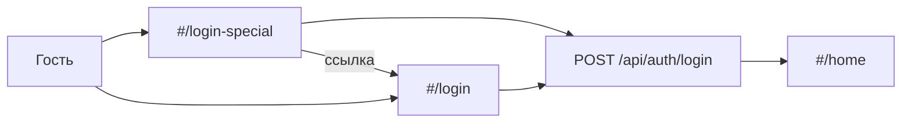

# Страница login-special и корневой README

## Цель

- Маршрут **`#/login-special`** — только для демонстрации: форма входа как на [`client/js/pages/login.js`](client/js/pages/login.js) (`POST /api/auth/login`, `setSession`, редирект на `#/home`).
- Блок с **9 тестовыми аккаунтами** (роль, email, пароль) из вашего списка.
- Кнопка/ссылка **«Обычный вход»** → `#/login`.
- **Корневой** [`README.md`](README.md) (расширенный вариант): запуск, env, storage, API-группы, демо-аккаунты, `#/login-special`.
- [`server/README.md`](server/README.md) — короткая отсылка к корневому README.
- Синхронизация [`report/README.md`](report/README.md) и правил в `.cursor/rules/`.



---

## 1. Клиент: страница `loginSpecial.js`

**Новый файл:** [`client/js/pages/loginSpecial.js`](client/js/pages/loginSpecial.js)

- Тот же каркас, что у `login.js`: `el()`, `.page.register-page`, `.register-card`, поля email/пароль, submit → `loginApi` + `setSession` + `#/home`, сообщения `.message` / `.message_error`.
- Заголовок, например: **«Вход (демо)»**.
- Константа `DEMO_ACCOUNTS` (массив `{ role, email, password }`) — 9 записей в порядке из запроса:

| Роль | Email |
|------|--------|
| Администратор | admin@admin.com |
| Внешний подрядчик | andrey@sokolov.ru |
| Менеджер | anna@ya.ru |
| Исполнитель | axle@ax.us |
| Клиент | coffehouse@ch.ch |
| Исполнитель | diana@protonmail.com |
| Клиент | green.coast@gc.com |
| Исполнитель | lilith@li.hk |
| Исполнитель | ser.gamer@gmail.com |

- **Список аккаунтов:** семантическая разметка (`<section>` + список/таблица): роль, email, пароль (`<code>`). Для демо — кнопка **«Подставить»** (или клик по строке), заполняющая `#login-special-email` / `#login-special-password` — ускоряет показ без дублирования логики API.
- **Шапка карточки** (паттерн `.register-card__header` из CSS): справа ссылка-кнопка **«Обычный вход»** → `href="#/login"`.
- Футер с регистрацией — как на обычном логине (`#/register`), опционально.

**Стили** в [`client/styles/main.css`](client/styles/main.css) — узкий блок, например `.login-special-accounts`: отступы, моноширинный пароль, `overflow-x: auto` на узких экранах; без инлайн-стилей.

**Не трогать** [`login.js`](client/js/pages/login.js) (минимальный diff), кроме случая, если позже захотите общий хелпер — сейчас не обязателен.

---

## 2. Роутер [`client/js/app.js`](client/js/app.js)

После ветки `login`, до `register`:

```javascript
if (normalized === 'login-special' && isLoggedIn()) {
  history.replaceState(null, '', '#/home');
  renderHomePage(appRoot);
  return;
}
if (normalized === 'login-special') {
  renderLoginSpecialPage(appRoot);
  return;
}
```

Поведение как у `#/login`:

- **Гостевой** маршрут (не в `isProtectedRoute`).
- При защищённом маршруте без сессии редирект остаётся на **`#/login`** (не на special).
- Пустой hash по-прежнему → `#/login`.
- Авторизованный на `#/login-special` → `#/home`.

---

## 3. Корневой README (перенос + расширение)

**Создать** [`README.md`](README.md) в корне репозитория.

**Содержание (полный вариант):**

1. **О проекте** — Mox, client + server, ссылка на [`report/README.md`](report/README.md) для детального отчёта.
2. **Структура репозитория** — `client/`, `server/`, `report/`, `server/storage/`.
3. **Быстрый старт**
   - PostgreSQL; `cd server && npm install`
   - `cp .env.example .env` (перечень ключей: `DATABASE_*`, `PORT`, `JWT_SECRET`, `JWT_EXPIRES_IN`, `REGISTER_USER_STATUS`, `INIT_DATE`)
   - `npm run db:init`
   - `npm run dev` / `npm start` → SPA на `http://localhost:PORT/`
4. **Медиа** — `server/storage/`, URL `/storage/…`, `src/paths.js`.
5. **REST API (группы)** — компактная таблица/список по префиксам (не дублировать весь отчёт):
   - `/api/health`, `/api/auth/*`, `/api/projects`, `/api/tasks`, `/api/collections`, `/api/media`, `/api/media/:id/comments`, `/api/notifications`, `/api/admin/*`
6. **Клиент** — hash-роутинг, `sessionStorage` JWT; **демо-вход** `#/login-special` и обычный `#/login`.
7. **Демо-аккаунты** — та же таблица роль / email / пароль (для презентации без открытия SPA); пометка: только для демо, пароли в клиентском бандле.
8. **Структура `server/src/`** — актуальное дерево (не устаревший фрагмент из текущего server README).

**Обновить** [`server/README.md`](server/README.md):

```markdown
# Сервер Mox

Документация по установке, переменным окружения, API и демо-входу — в [README в корне репозитория](../README.md).
```

Удалять файл не нужно — ссылки из `server/` и привычка «README рядом с package.json» сохраняются.

---

## 4. Синхронизация документации

| Файл | Изменение |
|------|-----------|
| [`report/README.md`](report/README.md) | В §4 (клиент): `loginSpecial.js`, маршрут `#/login-special`; в §8 (аутентификация) — гостевые маршруты `login`, `register`, `login-special`; ссылка на корневой README для быстрого старта |
| [`.cursor/rules/project-structure.mdc`](.cursor/rules/project-structure.mdc) | `loginSpecial.js` в списке `js/pages/` |
| [`.cursor/rules/frontend-architecture.mdc`](.cursor/rules/frontend-architecture.mdc) | Гостевые маршруты: `login-special`; редирект при `isLoggedIn()` |
| [`.cursor/rules/access-matrix.mdc`](.cursor/rules/access-matrix.mdc) | Строка UI: `#/login-special` — все роли, как `#/login` |

[`report/deployment.md`](report/deployment.md) — без изменений (уже ссылается на `report/README.md`).

---

## 5. Вне scope (намеренно)

- **Backend** — отдельный эндпоинт не нужен; те же `POST /api/auth/login`.
- Ссылка с `#/login` на special — не запрашивалась.
- Коммит — только по вашей просьбе.

---

## Порядок реализации

1. `loginSpecial.js` + CSS.
2. Ветки в `app.js`.
3. Корневой `README.md` + stub в `server/README.md`.
4. Правки `report/README.md` и `.cursor/rules/*`.

## Проверка вручную

- Открыть `#/login-special` без сессии — форма, список аккаунтов, «Подставить» + «Войти» для `admin@admin.com`.
- «Обычный вход» → `#/login`.
- После входа `#/login-special` → `#/home`.
- Защищённый `#/home` без сессии → `#/login` (не special).
