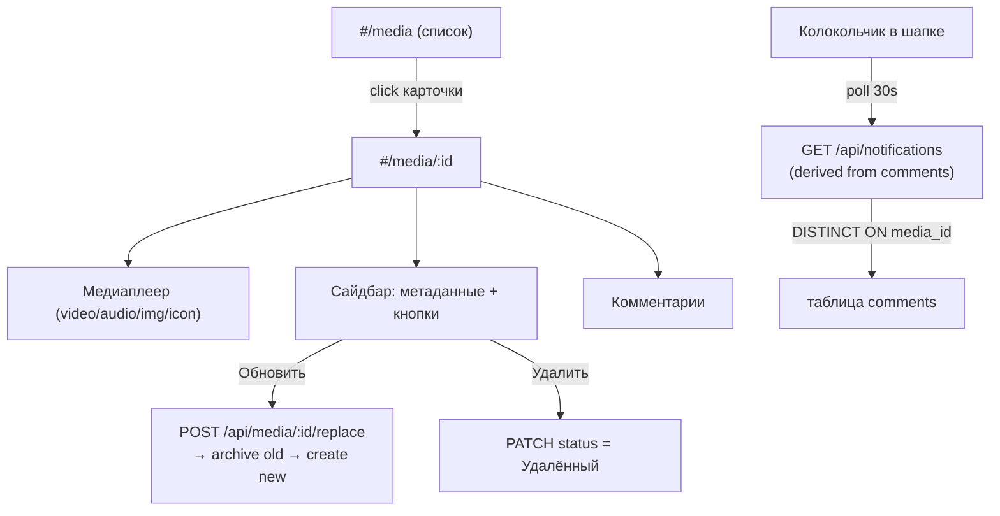

# Media Detail Page — Plan

## Архитектура экрана



Изменения в БД не требуются — уведомления выводятся как производный запрос поверх существующей таблицы `comments`. Состояние «прочитано» хранится на клиенте в `localStorage` (`mox_notifications_last_seen` — ISO-timestamp).

## 2. Backend

### `server/src/routes/media.js` — добавить маршруты

- **`GET /api/media/:id`** — одно медиа с контекстом (`projectId/Name`, `taskId/Name`, `collectionId/Name`, `statusId/Name`). Видимость: та же, что у `GET /api/media`; 403 для Клиента/Внешнего подрядчика, 404 если нет доступа.
- **`DELETE /api/media/:id`** — soft-delete: `UPDATE media SET status_id = (SELECT id FROM statuses_media WHERE name = 'Удалённый') WHERE id = $1`. Доступ: Менеджер, Админ, Исполнитель.
- **`PATCH /api/media/:id`** — Менеджер, Админ, Исполнитель. Body (JSON): `description` (строка). Обновляет `media.description`. Возвращает обновлённый объект медиа.
- **`POST /api/media/:id/replace`** — multipart, только Менеджер/Админ. Шаги в транзакции:
  1. Найти старое медиа (проверить доступ).
  2. Загрузить новый файл (`multer`, то же место `storage/`).
  3. `INSERT` новой записи media с тем же `collection_id`, статус `'Активный'`.
  4. `UPDATE` старой записи: `status_id = 'Архивный'`.
  5. Вернуть `{ media: <new record> }`.

### Новый `server/src/routes/comments.js`

- **`GET /api/media/:mediaId/comments`** — список; JOIN users для `userName`; порядок по `created_at` ASC. Видимость: та же, что у `GET /api/media/:id`.
- **`POST /api/media/:mediaId/comments`** — только Исполнитель, Менеджер, Админ. Создать комментарий. Никаких дополнительных записей не создаётся — уведомления строятся на лету через `GET /api/notifications`.

### Новый `server/src/routes/notifications.js`

- **`GET /api/notifications`** — только Менеджер и Админ; иначе 403. Derived query: для каждого `media_id` выбирает **последний** комментарий из проектов, где текущий пользователь состоит как участник (`user_project.excluded_at IS NULL`), затем сортирует результат по `created_at DESC`, лимит 50.

```sql
SELECT * FROM (
  SELECT DISTINCT ON (c.media_id)
    c.media_id, m.name AS media_name,
    c.text, c.created_at,
    u.name AS commenter_name,
    p.id AS project_id, t.id AS task_id, col.id AS collection_id
  FROM comments c
  JOIN media m   ON m.id  = c.media_id
  JOIN collections col ON col.id = m.collection_id
  JOIN tasks t   ON t.id  = col.task_id
  JOIN projects p ON p.id = t.project_id
  JOIN user_project up ON up.project_id = p.id
    AND up.user_id = $1 AND up.excluded_at IS NULL
  JOIN users u   ON u.id  = c.user_id
  ORDER BY c.media_id, c.created_at DESC
) sub
ORDER BY sub.created_at DESC
LIMIT 50
```

Нет эндпоинта «пометить прочитанным» — состояние читанности хранится на клиенте в `localStorage`.

### `server/src/server.js`

Смонтировать новые роутеры:
```js
import commentsRouter from './routes/comments.js';
import notificationsRouter from './routes/notifications.js';
// ...
app.use('/api', commentsRouter);
app.use('/api', notificationsRouter);
```

## 3. Frontend

### Новые API-обёртки

**`client/js/api/media.js`** — добавить:
- `fetchMediaById(id)` → `GET /api/media/:id`
- `updateMedia(id, { description })` → `PATCH /api/media/:id`
- `deleteMedia(id)` → `DELETE /api/media/:id`
- `replaceMedia(id, file)` → `POST /api/media/:id/replace` (FormData)

**`client/js/api/comments.js`** (новый):
- `fetchComments(mediaId)` → `GET /api/media/:mediaId/comments`
- `addComment(mediaId, text)` → `POST /api/media/:mediaId/comments`

**`client/js/api/notifications.js`** (новый):
- `fetchNotifications()` → `GET /api/notifications`

### `client/js/pages/mediaDetail.js` (новый)

`renderMediaDetailPage(container, mediaId)`:

- Скелетон → `fetchMediaById` → разворачивает двухколоночный макет:
  - **Левая колонка (~ 65 %):** медиаплеер
    - `video/*` → `<video controls src="…">`
    - `audio/*` / расширения аудио → `<audio controls src="…">`
    - изображения → `` (через `isProbablyImage`)
    - прочее → иконка типа (через `mediaKindFromExtension`)
  - **Правая колонка (~ 35 %):** метаданные
    - Название, статус (badge), формат, дата загрузки
    - Ссылки: Проект → `#/project/:id`, ТЗ → `#/project/:id/tasks/:taskId`, Коллекция → `#/project/:id/collections/:collectionId`
    - **Описание** (Менеджер, Админ, Исполнитель): рядом с полем кнопка `edit-24.svg` → поле становится `<textarea>`, кнопка меняется на `save-24.svg` → `updateMedia(id, { description })` → откат к просмотровому режиму; Esc или клик вне поля → отмена без сохранения.
    - **Обновить** (только Менеджер/Админ): hidden `<input type="file">`, confirm при успехе → navigate to new `#/media/:newId`
    - **Удалить** (Менеджер, Админ, Исполнитель): confirm → `deleteMedia` → `#/media`
- **Секция комментариев** (ниже, полная ширина): список с `userName` + `createdAt` + текст; форма добавления (textarea + кнопка) для Исполнителя / Менеджера / Админа.

### Колокольчик уведомлений — `client/js/utils/notificationBell.js` (новый)

`renderNotificationBell(headerActionsEl)`:
- Кнопка `<button>` с иконкой `icons/notifications-24.svg` и badge-счётчиком непрочитанных.
- «Непрочитанные» = уведомления с `created_at > localStorage.getItem('mox_notifications_last_seen')`.
- `fetchNotifications()` → обновить badge; повторять раз в 30 сек (через `setInterval`; очищается по `AbortController`-сигналу при смене маршрута).
- Клик → dropdown-список уведомлений (последний комментарий к медиа, ссылка `#/media/:mediaId`); при открытии dropdown → `localStorage.setItem('mox_notifications_last_seen', new Date().toISOString())` и badge → 0.
- Показывается только для Менеджера и Админа (проверка через `getUserSnapshot()`).
- Вызывается из `renderMediaDetailPage` в правую часть шапки; функция спроектирована так, чтобы подключаться к любой шапке.

### `client/js/app.js`

- `isProtectedRoute`: добавить `segs[0] === 'media' && segs.length === 2 && /^\d+$/.test(segs[1])`.
- В `route()`: ветка `segs[0] === 'media' && segs.length === 2 && /^\d+$/.test(segs[1])` → блок Клиент/Внешний подрядчик → `renderMediaDetailPage(appRoot, segs[1])`.

### `client/js/pages/mediaList.js`

Карточки медиа сделать кликабельными: заголовок-ссылка на `#/media/:id` (аналогично tasksList.js для task cards); убрать класс `project-card--static`.

### `client/styles/main.css`

Добавить стили:
- `.media-detail` — двухколоночный flex/grid (65/35).
- `.media-player` — `max-height: 70vh`, `object-fit: contain`, `<video>`/`<audio>` 100 % ширины.
- `.comments-section` — список комментариев, форма.
- `.notification-bell` — позиционирование badge, dropdown.

## 4. Синхронизация документации

- **`backend-api.mdc`** — добавить секции для `GET/PATCH/DELETE /api/media/:id`, `POST /api/media/:id/replace`, `GET/POST /api/media/:mediaId/comments`, `GET /api/notifications`.
- **`frontend-architecture.mdc`** — добавить `#/media/:id` (`mediaDetail.js`), описание `notificationBell.js`, обновить `js/api/media.js`.
- **`project-structure.mdc`** — добавить новые файлы.
- **`database-schema.mdc`** — без изменений (таблицы не добавляются).