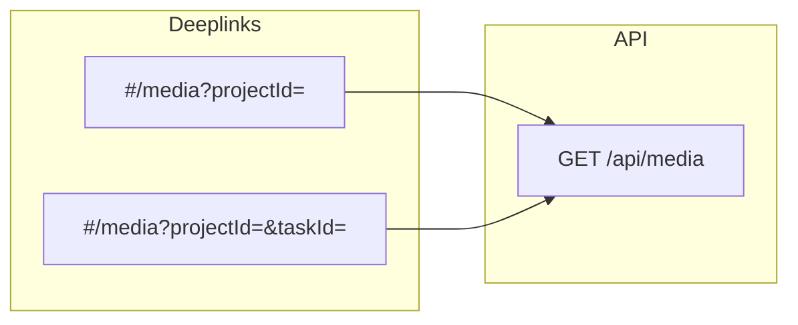

# Список медиа, фильтры и диплинки

## Контекст

- Таб **«Медиа»** уже ведёт на [`#/media`](c:\Users\eQurane\VSCode\mox\client\js\nav\dashboardTabs.js), но в [`client/js/app.js`](c:\Users\eQurane\VSCode\mox\client\js\app.js) нет ветки `media` и маршрут не в [`isProtectedRoute`](c:\Users\eQurane\VSCode\mox\client\js\app.js) — сейчас это фактически «страница не найдена».
- Данные медиа в БД: `media` → `collections` → `tasks` → `projects`; видимость как у [`GET /api/collections`](c:\Users\eQurane\VSCode\mox\server\src\routes\collections.js): **Админ/Менеджер** — все проекты; иначе — только проекты с активным `user_project`.
- На странице проекта секция **«Мультимедиа»** сейчас только ведёт на заглушку создания ([`sectionHeading(hrefMedia, 'Мультимедиа')`](c:\Users\eQurane\VSCode\mox\client\js\pages\projectDetail.js) при `hrefMedia = #/project/.../media/new`); у **ТЗ** и **коллекций** уже есть заголовок + кнопка списка (`list-24.svg`) на `#/tasks?projectId=…` и `#/collections?projectId=…`.

## Бэкенд

- Новый модуль [`server/src/routes/media.js`](c:\Users\eQurane\VSCode\mox\server\src\routes\media.js) по образцу [`collections.js`](c:\Users\eQurane\VSCode\mox\server\src\routes\collections.js):
  - **`GET /media`** с `requireAuth`, `fetchRoleNameByUserId`, тот же `seeAll` / `EXISTS (user_project … excluded_at IS NULL)` на `t.project_id`.
  - Join: `media m` → `collections c` → `tasks t` → `projects p` → `statuses_media sm`.
  - **Query (все опционально):**
    - **`projectId`**, **`taskId`**, **`collectionId`** — целые ≥ 1; неверный формат → **400**; вне видимости → **200** с пустым массивом (как у коллекций). При **обоих** `projectId` и `taskId` — логическое **И** (как в коллекциях).
    - **`statusId`** — целое ≥ 1 и запись в **`statuses_media`**, иначе **400**.
    - **`uploadFrom`**, **`uploadTo`** — **`YYYY-MM-DD`**, inclusive по `m.upload_at::date`; проверка формата и порядка дат как в [`tasks.js`](c:\Users\eQurane\VSCode\mox\server\src\routes\tasks.js) / [`collections.js`](c:\Users\eQurane\VSCode\mox\server\src\routes\collections.js).
    - **Опционально `q`** — подстрока по `m.name` (`ILIKE` + escape, как в коллекциях) — для паритета с `#/tasks` и `#/collections` (быстрый поиск по имени файла).
  - **200:** `{ media: [...], statuses: [{ id, name }] }` где `statuses` — полный справочник **`statuses_media`** (ORDER BY `id`).
  - Элемент **`media`:** поля как в ответе **`GET /api/projects/:id`** (`id`, `collectionId`, `path`, `name`, `format`, `description`, `uploadAt`, `statusName`) **плюс** `statusId` и контекст для карточек: **`projectId`**, **`projectName`**, **`taskId`**, **`taskName`**, **`collectionName`**.
  - Сортировка: **`upload_at DESC NULLS LAST`**, затем `id DESC`.
- Подключить роутер в [`server/src/server.js`](c:\Users\eQurane\VSCode\mox\server\src\server.js) (`app.use('/api', mediaRouter)`).

## Клиент

- **[`client/js/api/media.js`](c:\Users\eQurane\VSCode\mox\client\js\api\media.js):** `fetchMedia(filters)` → `GET /api/media` с Bearer и query (тот же стиль, что [`collections.js`](c:\Users\eQurane\VSCode\mox\client\js\api\collections.js)).
- **[`client/js/pages/mediaList.js`](c:\Users\eQurane\VSCode\mox\client\js\pages\mediaList.js):** по структуре близко к [`collectionsList.js`](c:\Users\eQurane\VSCode\mox\client\js\pages\collectionsList.js):
  - `renderMediaListPage(appRoot, searchParams)`, шапка с [`appendDashboardSectionTabs`](c:\Users\eQurane\VSCode\mox\client\js\nav\dashboardTabs.js) (`active: 'media'`), поиск с debounce ~300 ms, **`history.replaceState`** для `#/media?…`.
  - **Фильтры в UI:** проект (`fetchProjects`), ТЗ (`fetchTasks` при выбранном проекте), коллекция (`fetchCollections` при выбранном ТЗ; при смене проекта/ТЗ сбрасывать зависимые поля), диапазон дат загрузки (два `input type="date"` → `uploadFrom` / `uploadTo`), статус медиа (select из `statuses` ответа).
  - **Диплинк `taskId` без `projectId`:** после первой успешной загрузки, если в списке есть строки — взять `projectId` с первой записи, обновить state/hash и перезаполнить селект ТЗ (аналог [`collectionsList.js` ~543–551](c:\Users\eQurane\VSCode\mox\client\js\pages\collectionsList.js)).
  - Карточки: переиспользовать паттерн превью/бейджа как в [`projectDetail.js` `buildMediaCard`](c:\Users\eQurane\VSCode\mox\client\js\pages\projectDetail.js) / [`MEDIA_STATUS_SLUG`](c:\Users\eQurane\VSCode\mox\client\js\pages\projectDetail.js); ссылка на проект `#/project/:id`; подписи проект / ТЗ / коллекция / дата загрузки / статус.
- **[`client/js/app.js`](c:\Users\eQurane\VSCode\mox\client\js\app.js):** добавить `'media'` в `isProtectedRoute`; ветка `segs[0] === 'media' && segs.length === 1` → `renderMediaListPage(appRoot, searchParams)`.

## Диплинки с существующих экранов

- **[`client/js/pages/projectDetail.js`](c:\Users\eQurane\VSCode\mox\client\js\pages\projectDetail.js):** для **«Мультимедиа»** сделать тот же `project-detail__section-head`, что у ТЗ/коллекций: заголовок-ссылка на `#/media?projectId=…`, кнопка со списком на тот же URL, отдельная ссылка **«Добавить медиа»** на `#/project/:id/media/new`.
- **Карточка ТЗ на проекте:** рядом с «Коллекции» добавить ссылку **«Медиа»** на `#/media?projectId=…&taskId=…`.
- **[`client/js/pages/tasksList.js`](c:\Users\eQurane\VSCode\mox\client\js\pages\tasksList.js):** на карточке задачи добавить ссылку **«Медиа»** с тем же построением `href`, что и для «Коллекции» (чтобы «со страницы ТЗ» работало и из глобального `#/tasks`).

## Документация (синхронизация по завершении)

Обновить только актуальные правила проекта (как в задаче):

| Файл | Что добавить |
|------|----------------|
| [`.cursor/rules/backend-api.mdc`](c:\Users\eQurane\VSCode\mox\.cursor\rules\backend-api.mdc) | Строка в сводке эндпоинтов + раздел **`GET /api/media`**: заголовок, видимость, все query, форма **200**, коды **400/401/500**. |
| [`.cursor/rules/frontend-architecture.mdc`](c:\Users\eQurane\VSCode\mox\.cursor\rules\frontend-architecture.mdc) | Защищённый маршрут **`#/media`**, описание **`mediaList.js`**, фильтры, hash sync, диплинки с проекта/ТЗ; поправить блок про **«Мультимедиа»** на `#/project/:id` (список + добавление). |
| [`.cursor/rules/backend-architecture.mdc`](c:\Users\eQurane\VSCode\mox\.cursor\rules\backend-architecture.mdc) | В списке защищённых маршрутов упомянуть **`GET /api/media`** и файл **`src/routes/media.js`**. |
| [`.cursor/rules/project-structure.mdc`](c:\Users\eQurane\VSCode\mox\.cursor\rules\project-structure.mdc) | `routes/media.js`, `pages/mediaList.js`, `api/media.js`. |

**Не трогать** [`database-schema.mdc`](c:\Users\eQurane\VSCode\mox\.cursor\rules\database-schema.mdc) — схема уже описывает `media` и `statuses_media`.

## Проверка после реализации

- Вручную: `#/media`, `#/media?projectId=1`, `#/media?taskId=…` (без проекта — подстановка проекта), с проекта и с `#/tasks` переходы; смена фильтров обновляет hash и список; неавторизованный доступ редиректит на `#/login`.
