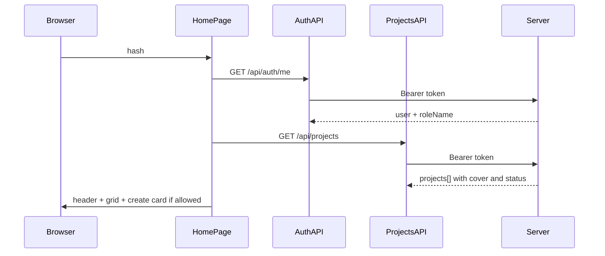

# Главный экран «Проекты» после авторизации (обновлённый план)

## Контекст

- Роутинг: `[client/js/app.js](c:\Users\eQurane\VSCode\mox\client\js\app.js)` → после логина `#/home`; гард по `isLoggedIn()`.
- Дом: `[client/js/pages/home.js](c:\Users\eQurane\VSCode\mox\client\js\pages\home.js)` сейчас заглушка.
- Стили: `[client/styles/main.css](c:\Users\eQurane\VSCode\mox\client\styles\main.css)` — расширить под широкий layout, шапку, карточку с превью, меню.
- БД: `projects`, `user_project`, цепочка `tasks` → `collections` → `media` в `[server/db_init/init.js](c:\Users\eQurane\VSCode\mox\server\db_init\init.js)`.
- JWT: payload содержит `roleId`; имя роли в ответе `/auth/me` пока отсутствует — **добавить** для надёжной проверки «Админ» / «Менеджер» на клиенте (не опираться на числовой id роли).

## Дизайн карточек и цвет статуса

- Карточка: **сверху блок превью** (фиксированное соотношение, например 16:9): если с бэкенда пришёл URL/путь обложки — показать (на первом этапе достаточно заглушки-иконки или нейтрального градиента, т.к. статика файлов может быть не отдана отдельным роутом — в плане реализации: `coverPath` с бэкенда как метаданные, отображение — placeholder до появления раздачи файлов); если медиа у проекта нет — **заглушка** (единый стиль).
- Снизу: **название** (как было), **даты начала/окончания**, **статус** с цветовой кодификацией (маппинг имён из `statuses_projects` → CSS-класс или CSS variables).
- **Цвет и края карточки:** полная обводка карточки цветом статуса на всех карточках сетки часто даёт визуальный шум и ухудшает читаемость при 20+ проектах. Практичнее: **тонкий акцент** (например `border-left: 4px` или верхняя полоска) **того же цвета**, что и бейдж статуса — связь статус↔карточка сохраняется без «моря» цветных рамок. Бейдж статуса остаётся основным носителем цвета. Если позже понадобится сильнее выделять проблемные статусы — можно усилить только для отдельных статусов.

## Роли и видимость проектов

- На сервере в `GET /api/projects` после аутентификации загрузить **имя роли** пользователя (JOIN `users` → `roles`).
- Если `role.name` — **«Админ»** или **«Менеджер»**: вернуть **все** строки из `projects` (с статусом и превью), **без** фильтра по `user_project`.
- Иначе: только проекты с активным членством: `user_project` где `user_id = req.userId` и `excluded_at IS NULL`.

Превью медиа (для обоих режимов один запрос): для каждого проекта одно представительское изображение — например подзапрос / `LATERAL` с `ORDER BY media.upload_at ASC` или `DESC` (в плане зафиксировать одно правило, напр. самое новое), путь `media.path`; если нет записей — `coverUrl: null`.

## Backend

1. **Middleware** `[server/src/middleware/auth.js](c:\Users\eQurane\VSCode\mox\server\src\middleware\auth.js)`: из заголовка Bearer — верификация JWT; `req.userId`, `req.roleId`; ошибки как в текущем API.
2. **Расширить** `[server/src/routes/auth.js](c:\Users\eQurane\VSCode\mox\server\src\routes\auth.js)` **GET `/auth/me`**: в ответ добавить `roleName` (из JOIN с `roles`), чтобы клиент мог показывать «Администрирование», карточку создания и гард маршрута без хардкода `roleId`.
3. **Роут** `[server/src/routes/projects.js](c:\Users\eQurane\VSCode\mox\server\src\routes\projects.js)`: `GET /api/projects` с логикой видимости выше + поля для UI: `id`, `name`, `goal`, `startDate`, `endDate`, `statusName`, `coverPath` | `coverUrl` (как договоримся: пока можно только path из БД).
4. Подключить роут в `[server/src/server.js](c:\Users\eQurane\VSCode\mox\server\src\server.js)`.

Клиент `[client/js/auth/session.js](c:\Users\eQurane\VSCode\mox\client\js\auth\session.js)` / вызовы `setSession`: убедиться, что после `fetchMe` в сессии сохраняется `roleName` (если кэшируется пользователь).

## Frontend: шапка, маршруты, карточки

### Шапка (на экране проектов и, по желанию, единый shell позже)

- Слева/центр: заголовок «Проекты»; рядом **вкладка или ссылка «Администрирование»**, видимая **только** при `roleName === 'Админ'` (ведёт на `#/admin`).
- Справа: кнопка **обновления списка** (повторный `fetchProjects`, иконка или текст «Обновить»), рядом **кнопка учётной записи** (аватар-заглушка или «Меню») — по клику **dropdown**: ФИО/email, пункт «Выйти». Доступность: `aria-expanded`, закрытие по Escape и клику вне, фокус-ловушка по минимуму.
- Информация о пользователе из шапки в явном виде убирается — только внутри dropdown.

### Маршруты ( `[client/js/app.js](c:\Users\eQurane\VSCode\mox\client\js\app.js)` )

- `#/home` — список проектов (текущая главная после логина).
- `#/project/:id` — **зарезервированная** страница детали (заглушка «Раздел в разработке» / название проекта необязательно на первом шаге); переход **по клику** на карточку (не на карточку «создать»).
- `#/projects/new` — **зарезервированная** страница создания проекта (заглушка); переход с **первой карточки** «Создать проект» (только **Админ** и **Менеджер**).
- `#/admin` — **зарезервированная** админка; при заходе не-админа редирект на `#/home` (или сообщение 403 — предпочтительно тихий редирект для SPA).

Все новые страницы — отдельные модули в `client/js/pages/…` по правилу «один файл — один экран».

### Сетка карточек

1. **Первая ячейка** (только для Админ и Менеджер): карточка-действие «Новый проект» / «Создать проект» (визуально отлична от проектных карточек — пунктир, плюс), клик → `#/projects/new`.
2. Остальные ячейки: карточки проектов в порядке ответа API (при необходимости позже добавить сортировку на сервере).
3. Пустой списимый кейс (нет проектов и нет права на create, или есть create но 0 проектов): осмысленный empty state; если есть только create-карточка — сетка всё равно выглядит нормально.

### API-слой

- `[client/js/api/projects.js](c:\Users\eQurane\VSCode\mox\client\js\api\projects.js)`: `fetchProjects()` с Bearer.

## Диаграмма потока

## Вне scope (без изменений по смыслу)

- Реальное создание/редактирование проекта (POST/PUT), загрузка файлов и отдача статики по `media.path`.
- Приглашения в `user_project`, фильтры, поиск.
- Обновление файлов правил в `.cursor/rules` — по желаний позже.

Реализация создания проекта и детальной страницы — следующими итерациями после заглушек.