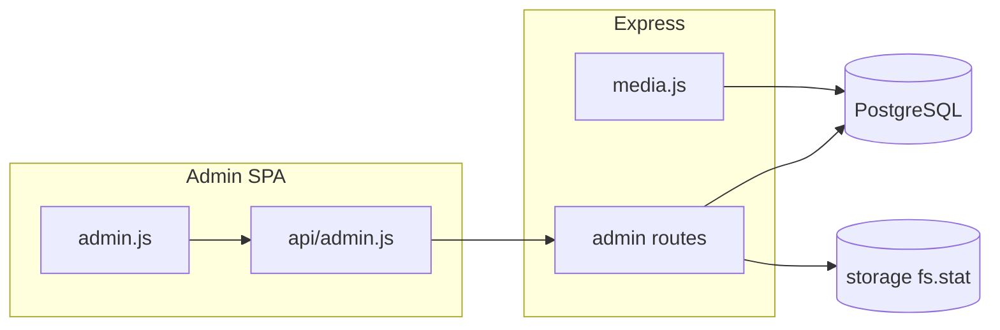

# Вкладка администрирования (Админ)

## Текущее состояние

- UI: [`client/js/pages/admin.js`](client/js/pages/admin.js) — заглушка; роут `#/admin` защищён в [`client/js/app.js`](client/js/app.js).
- Бэкенд: отдельного роутера админки нет; [`server/src/server.js`](server/src/server.js) монтирует существующие маршруты.
- Пользователи: [`statuses_users`](server/db_init/init.js) — **«На подтверждении»**, **«Активный»**, **«Отключён»**. Стартовый статус при регистрации задаётся **`REGISTER_USER_STATUS`** в окружении ([`server/src/routes/auth.js`](server/src/routes/auth.js)); для модерации в `.env` выставляют **`На подтверждении`** (см. раздел ниже).
- Медиа: `DELETE /api/media/:id` — soft-delete ([`server/src/routes/media.js`](server/src/routes/media.js)). Файлы лежат в [`storageDir`](server/src/paths.js), публичный путь вида `/storage/<имя файла>`.

## Ограничения (уточнение ТЗ)

- **Схему PostgreSQL не менять** — без новых колонок и таблиц.
- **Автоудаление по таймеру не делаем** — ни полей в БД, ни фоновых задач purge.
- **«Крупные медиа»:** сервер **сканирует каталог `storage/`** (`fs.readdir` + `stat`), отбирает файлы **размером > 50 МБ** (50 * 1024 * 1024 байт), сортирует по убыванию размера. Сопоставление с сущностью в приложении: по имени файла из пути (`media.path` хранит `/storage/<basename>`) — `SELECT` из `media` (и при необходимости JOIN контекста проекта/ТЗ/коллекции как в существующих запросах). Файлы без записи в `media` (осиротевшие на диске) **полезно показать отдельной строкой** «нет в БД» — орфаны возможны после сбоев или ручных правок.

## 1. `REGISTER_USER_STATUS` и `.env`

- В **[`server/.env.example`](server/.env.example)** (создать при отсутствии) явно описать переменную **`REGISTER_USER_STATUS`**, пример: `REGISTER_USER_STATUS=На подтверждении` для очереди подтверждения или `Активный` для упрощённого dev.
- В **[`server/src/routes/auth.js`](server/src/routes/auth.js)** оставить чтение из **`process.env.REGISTER_USER_STATUS`**; если сейчас есть fallback в коде — сохранить разумную совместимость **или** при отсутствии переменной возвращать понятную **ошибку конфигурации** при регистрации — выбрать один вариант и отразить в `backend-api.mdc`.
- В **[`.cursor/rules/backend-api.mdc`](.cursor/rules/backend-api.mdc)** зафиксировать: стартовый статус регистрации определяется **`REGISTER_USER_STATUS`** (значение — **`name`** из `statuses_users`).

## 2. Middleware и роутер админки

- **`requireAdmin`**: после `requireAuth` — роль из БД; только **«Админ»** иначе **403**.
- **[`server/src/routes/admin.js`](server/src/routes/admin.js)** + монтирование в [`server/src/server.js`](server/src/server.js).

**Пользователи:**

- `GET /api/admin/users` — `q`, фильтры по статусу/роли, пагинация.
- `GET /api/admin/users/:id` — профиль + активные проекты из `user_project`.
- `PATCH /api/admin/users/:id` — `roleId` / `statusId`, валидация; защита от «снять себе админа» / заблокировать себя.

**Модерация:**

- `GET /api/admin/users?statusName=На подтверждении` или отдельный алиас — на усмотрение реализации.
- `POST /api/admin/users/:id/approve` → статус **«Активный»**.
- `DELETE /api/admin/users/:id` — только **«На подтверждении»** и нет блокирующих связей (`user_project`, `comments`, …); иначе **409**. Для активных — действие «отключить» через **PATCH** (статус **«Отключён»**).

**Обзор:**

- `GET /api/admin/overview` — агрегаты по БД (пользователи по статусам, проекты, ТЗ, коллекции, медиа по статусам). **Без суммы размеров из БД.** При желании — опционально `storageLargeFilesCount` из того же сканера, что и раздел медиа (или не дублировать — достаточно отдельного эндпоинта ниже).

**Проблемы:**

- `GET /api/admin/issues` — проекты без активных участников; счётчик/список пользователей «На подтверждении»; по желанию — ТЗ без коллекций / коллекции без медиа (только `SELECT`, без DDL).

**Медиа (обслуживание):**

- `GET /api/admin/storage/large-files` (или `GET /api/admin/media/large-storage-files`) — скан **`storageDir`**, порог **> 50 МБ**, сопоставление с `media` по `path`, лимит записей в ответе.
- `DELETE /api/admin/media/:id` — **жёсткое удаление** только для админа: файл по пути из `media.path`, затем `comments` для этого `media_id`, затем строка `media`. Идемпотентность при отсутствии файла — по политике: лог + продолжить удаление в БД.

## 3. Существующий `media.js`

- **Не трогать схему.** При необходимости только переиспользовать/экспортировать вспомогательные функции (маппинг пути → абсолютный файл) без изменения поведения публичного `DELETE /api/media/:id`.

## 4. Клиент

- [`client/js/api/admin.js`](client/js/api/admin.js) — обёртки к `/api/admin/...`.
- [`client/js/pages/admin.js`](client/js/pages/admin.js) — вкладки: **Пользователи** | **Регистрации** | **Обзор** | **Проблемы** | **Медиа**; в медиа — таблица **файлов > 50 МБ** (размер, путь, привязка к карточке медиа/проекту), **«Удалить навсегда»**; **без** UI автоудаления и без schedulers.
- Подсказка про **JWT** после смены роли другому пользователю.

## 5. Документация (обязательно)

- [`.cursor/rules/backend-api.mdc`](.cursor/rules/backend-api.mdc) — новые маршруты `/api/admin/...`, семантика large-files и hard-delete, **`REGISTER_USER_STATUS`**.
- [`.cursor/rules/access-matrix.mdc`](.cursor/rules/access-matrix.mdc) — строки/блок про админ-API (только **Админ**).
- [`.cursor/rules/frontend-architecture.mdc`](.cursor/rules/frontend-architecture.mdc) — кратко описать экран `#/admin` и `api/admin.js`, если там перечисляются страницы/API.
- [`.cursor/rules/database-schema.mdc`](.cursor/rules/database-schema.mdc) — **не** добавлять колонки; при необходимости одна фраза, что размер файлов на диске в схеме не хранится.

## Риски

- **Тяжёлый каталог `storage/`:** скан при каждом открытии вкладки может быть медленным; при необходимости кэш на 1–2 минуты в памяти процесса (вне БД) — опционально в реализации.
- **Орфаны:** файлы без `media` — только отчёт; удаление их отдельной кнопкой можно отложить или добавить позже «удалить файл с диска» без FK.
