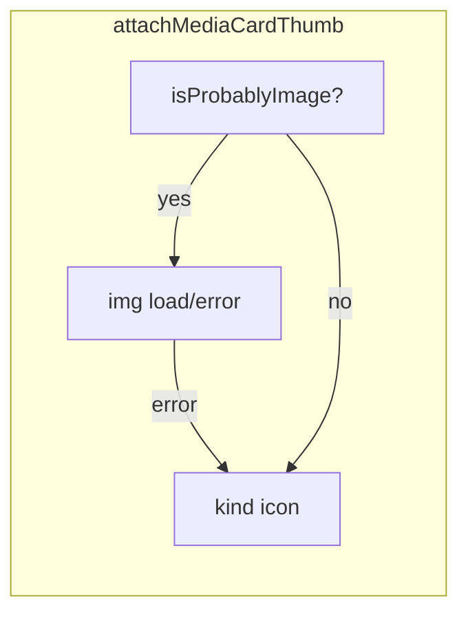

# Иконки на карточках медиа вместо пустой заглушки

## Контекст

Сейчас в [`client/js/pages/mediaList.js`](client/js/pages/mediaList.js) функция `buildMediaCard` (стр. 128–190):

- Для «вероятного изображения» (`isProbablyImage` по `format` и `path`) вставляет ``; при `load` снимается класс `project-card__media--placeholder`, при `error` — только `img.remove()`, блок остаётся без превью.
- Для видео, аудио, таблиц, документов превью нет: видна только декоративная рамка из [`client/styles/main.css`](client/styles/main.css) (`.project-card__media--placeholder::after`, стр. 657–667).

На бэкенде поле `format` — это расширение файла ([`server/src/routes/media.js`](server/src/routes/media.js), `safeExtension` → `formatStr`), то есть классификация по расширению согласуется с клиентом.

Тот же паттерн скопирован в [`projectDetail.js`](client/js/pages/projectDetail.js), [`taskDetail.js`](client/js/pages/taskDetail.js), [`collectionDetail.js`](client/js/pages/collectionDetail.js) — по четыре раза дублируется `isProbablyImage` и логика превью.

## Решение

### 1. Новый модуль [`client/js/utils/mediaCardThumb.js`](client/js/utils/mediaCardThumb.js)

- Константы путей к иконкам — как в [`mediaNew.js`](client/js/pages/mediaNew.js) (`FILE_KIND_ICONS`: video → `video-24.svg`, audio → `music-24.svg`, table → `table-24.svg`, docs → `docs-24.svg`).
- Функция классификации по расширению **`mediaKindFromExtension(ext)`** — те же списки расширений, что в `fileKind()` в `mediaNew.js` (video / audio → иконка музыки / table / docs, неизвестное → docs). Источник расширения: сначала `item.format`, иначе из `item.name` или `item.path`.
- Экспорт **`isProbablyImage(format, path)`** — текущая реализация из списков (чтобы убрать четыре копии).
- Экспорт **`attachMediaCardThumb(mediaTop, item)`**, где `mediaTop` — уже созданный `div.project-card__media`:
  - если изображение — класс с `project-card__media--placeholder`, ``, на `load` убрать placeholder, на `error` заменить содержимое на режим иконки;
  - иначе сразу режим иконки по `mediaKindFromExtension`.

Режим иконки: не использовать класс `project-card__media--placeholder` (убрать конфликт с `::after`), использовать новый модификатор, например `project-card__media--kind-icon`, внутри — `` с классом вроде `project-card__kind-icon` и увеличенными размерами через CSS (например **48×48 или 56×56** вместо исходных 24×24).

### 2. Стили в [`client/styles/main.css`](client/styles/main.css)

- Блок для `.project-card__media--kind-icon`: flex, выравнивание по центру (фон как у обычного `.project-card__media`).
- `.project-detail__media-card .project-card__kind-icon` (или общий селектор): фиксированный размер, `opacity` при желании как у `.media-new-queue__thumb-icon`.

### 3. Обновить четыре страницы

В каждой заменить локальный `isProbablyImage` и ручную сборку `mediaTop` внутри `buildMediaCard` на вызов `attachMediaCardThumb(mediaTop, item)` из нового модуля:

- [`mediaList.js`](client/js/pages/mediaList.js) — целевой экран `#/media`.
- [`projectDetail.js`](client/js/pages/projectDetail.js), [`taskDetail.js`](client/js/pages/taskDetail.js), [`collectionDetail.js`](client/js/pages/collectionDetail.js) — те же карточки медиа в деталях.

Импорты ES-модулей добавить в каждый файл; дублирующие функции удалить.

### 4. Синхронизация документации

После реализации правки в правилах Cursor, чтобы будущие изменения не расходились с кодом:

- **[`.cursor/rules/frontend-architecture.mdc`](.cursor/rules/frontend-architecture.mdc)**
  - В блоке **`#/media` (`mediaList.js`)**: заменить формулировку «Карточки с превью изображений» на точную — превью через `` для изображений/GIF; для не‑изображений и при ошибке загрузки превью — крупные иконки типов из **`icons/`** (`video-24.svg`, `music-24.svg`, `table-24.svg`, `docs-24.svg`), общая логика в **`js/utils/mediaCardThumb.js`** (`attachMediaCardThumb` и классификация по расширению, согласованная с **`mediaNew.js`**).
  - В соответствующих абзацах **`projectDetail.js`**, **`taskDetail.js`**, **`collectionDetail.js`** (секции медиа‑сеток): кратко указать то же поведение превью, что на **`#/media`** (ссылка на утилиту), чтобы не дублировать длинное описание четыре раза — достаточно одной явной отсылки «как в списке медиа».
  - В дереве **`client/js/`**: добавить каталог **`utils/`** с файлом **`mediaCardThumb.js`** (рядом с упоминанием `js/components/` и `js/utils/`).
- **[`.cursor/rules/project-structure.mdc`](.cursor/rules/project-structure.mdc)**
  - В секции **`client/`**: после `js/pages/` или `js/api/` добавить строку про **`js/utils/`** — например **`mediaCardThumb.js`** для превью карточек медиа в списке и на страницах деталей.

Отдельные файлы README в репозитории пользователь не просил — только правила проекта.

## Замечания по UX

- **JPEG/PNG/WebP/GIF/SVG** — по-прежнему превью через ``; иконка только если загрузка не удалась.
- Единая карта типов с экраном загрузки снижает расхождение поведения между очередью файлов и списком медиа.

