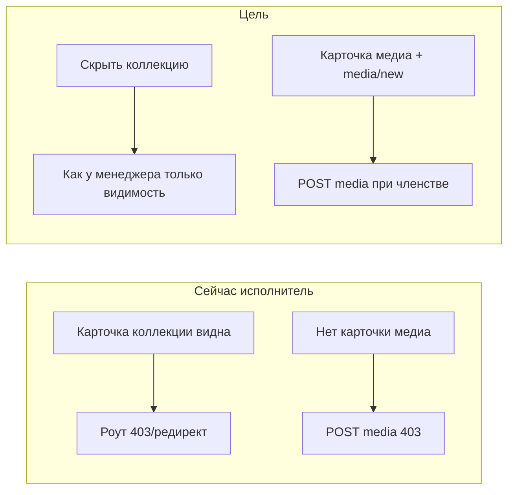

# План: медиа и коллекции для роли «Исполнитель»

## Диагностика

**Карточка «Новая коллекция» на проекте** — в [`client/js/pages/projectDetail.js`](client/js/pages/projectDetail.js) карточка показывается при `!hideNewCollectionControls`, где `hideNewCollectionControls` = только «Клиент» или «Внешний подрядчик» (стр. 186–189, 391–393). **Исполнитель** попадает в ветку с карточкой, но маршрут `#/project/:id/collections/new` в [`client/js/app.js`](client/js/app.js) редиректит не-Админ/не-Менеджер на `#/home` (стр. 157–165). На API [`POST /api/collections`](server/src/routes/collections.js) тоже только `requireManagerOrAdmin`. Исправление: **не показывать** карточку исполнителю (как для клиента/подрядчика по смыслу «нет права создавать коллекцию»).

**Карточка «Добавить медиа»** — на проекте она добавляется только если `canManageTasks || roleName === 'Внешний подрядчик'` (стр. 437–438), на коллекции — если Админ/Менеджер/подрядчик ([`collectionDetail.js`](client/js/pages/collectionDetail.js), стр. 252–254). Маршрут `#/project/:id/media/new` в [`app.js`](client/js/app.js) разрешает только Админ, Менеджер, Внешний подрядчик (стр. 186–196). На бэкенде [`POST /api/media`](server/src/routes/media.js) при `!isManager && !isContractor` возвращает **403** (стр. 388–393). Для исполнителя нужно согласовать **UI + роут + API**.

## Изменения в коде

### 1. Backend — разрешить загрузку исполнителю

Файл: [`server/src/routes/media.js`](server/src/routes/media.js), обработчик `POST /api/media`.

- После вычисления `isManager` / `isContractor` добавить проверку роли **«Исполнитель»** (или константу рядом с `ROLES_CAN_MODIFY`).
- Условие отказа: `if (!isManager && !isContractor && !isExecutor) return 403`.
- Дальше без изменений: `fetchProjectDatesIfVisible` уже даёт доступ исполнителю по **`user_project`** (стр. 134–155) — коллекция в чужом проекте остаётся **404** «Коллекция не найдена.».
- Блок `if (isContractor) { ... }` не трогать — для исполнителя лишних ограничений по типу задания не добавляем (в отличие от подрядчика).

### 2. Frontend — проект

Файл: [`client/js/pages/projectDetail.js`](client/js/pages/projectDetail.js)

- **Коллекции:** расширить флаг, например `hideNewCollectionControls = Клиент || Подрядчик || Исполнитель` (или ввести явный `canCreateCollection = Админ || Менеджер` и использовать его для карточки «Новая коллекция»).
- **Медиа:** показывать `buildSectionCreateCard(hrefMedia, 'Добавить медиа')` также для **Исполнитель** (референс — текущая ветка для менеджера/подрядчика): например `canManageTasks || roleName === 'Внешний подрядчик' || roleName === 'Исполнитель'`.

### 3. Frontend — коллекция

Файл: [`client/js/pages/collectionDetail.js`](client/js/pages/collectionDetail.js)

- В условие для карточки «Добавить медиа» добавить `roleName === 'Исполнитель'`.
- Пересмотреть пустое состояние: сейчас при отсутствии медиа для Клиент/Исполнитель показывается «Нет медиа.» — при появлении карточки у исполнителя оставить только сообщение для **Клиента**, чтобы не дублировать пустой текст рядом с карточкой (аналогично логике на странице проекта для медиа).

### 4. Frontend — роутер

Файл: [`client/js/app.js`](client/js/app.js)

- В ветке `project/.../media/new` добавить **`Исполнитель`** к разрешённым ролям (рядом с Админ, Менеджер, Внешний подрядчик).

### 5. (Рекомендация) Экран задания — единообразие

Файл: [`client/js/pages/taskDetail.js`](client/js/pages/taskDetail.js) — там **та же** комбинация: карточка «Новая коллекция» при `!hideNewCollectionControls` и медиа только для `canManageTasks || подрядчик`. Имеет смысл применить те же правки, чтобы исполнитель не видел «битую» коллекцию и видел загрузку медиа с экрана задания. Если нужно строго только проект/коллекция — этот пункт можно опустить.

Страница [`mediaNew.js`](client/js/pages/mediaNew.js) правок не требует: она уже тянет проект и коллекции через API с проверкой членства.

## Документация (синхронизация)

Обновить согласованно с поведением:

| Файл | Что изменить |
|------|----------------|
| [`.cursor/rules/access-matrix.mdc`](.cursor/rules/access-matrix.mdc) | Таблица **POST /api/media** — для Исполнителя ✅ при членстве; блок **UI** — `#/project/:id/media/new` для Исполнителя; уточнить, что карточка создания коллекции на проекте не для Исполнителя. |
| [`.cursor/rules/backend-api.mdc`](.cursor/rules/backend-api.mdc) | Секция **POST /api/media** — доступ: Админ, Менеджер, Внешний подрядчик, **Исполнитель** (членство). |
| [`.cursor/rules/frontend-architecture.mdc`](.cursor/rules/frontend-architecture.mdc) | Описания `#/project/:id`, `#/project/:id/collections/new`, `#/project/:id/media/new`, `#/project/.../collections/:id` — карточки и роли. |
| [`report/README.md`](report/README.md) | Матрица «Создание … медиа» и строка `POST /api/media` в таблице эндпоинтов — отразить загрузку для Исполнителя; при необходимости уточнить формулировку про создание коллекций (без исполнителя). |

## Проверка вручную

- Войти как **Исполнитель**, участник проекта: на `#/project/:id` — есть «Добавить медиа», нет «Новая коллекция»; переход на загрузку и успешный `POST` в коллекцию этого проекта.
- На `#/project/:id/collections/:cid` — карточка «Добавить медиа», загрузка с префиллом `collectionId` из query.
- Исполнитель **вне** проекта — по-прежнему 404 на проект / коллекцию; загрузка в чужую коллекцию — 404 с сервера.
