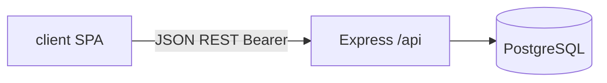

# План: обновление документации в `.cursor/rules`

## Контекст расхождений

- **[backend-architecture.mdc](.cursor/rules/backend-architecture.mdc)** утверждает, что JWT/сессии и защищённые маршруты «ещё не реализованы», тогда как в коде уже есть [`jsonwebtoken`](server/src/routes/auth.js), [`middleware/auth.js`](server/src/middleware/auth.js) (`Bearer`), [`jwtSecret.js`](server/src/jwtSecret.js) (`JWT_SECRET`, `JWT_EXPIRES_IN`, обязательность секрета в production).
- **[backend-api.mdc](.cursor/rules/backend-api.mdc)** описывает только health и регистрацию; не документированы `POST /api/auth/login`, `GET /api/auth/me`, `GET /api/projects`, заголовок `Authorization`, а в ответе регистрации в коде есть `roleName`.
- **[frontend-architecture.mdc](.cursor/rules/frontend-architecture.mdc)** устарел: дефолтный маршрут и пустой hash ведут на **`#/login`** (не `register`), есть защищённые маршруты и проверки ролей в [`client/js/app.js`](client/js/app.js), сессия в [`client/js/auth/session.js`](client/js/auth/session.js), API в [`client/js/api/auth.js`](client/js/api/auth.js) и [`client/js/api/projects.js`](client/js/api/projects.js).
- **[project-structure.mdc](.cursor/rules/project-structure.mdc)** неполный: в `server/` не перечислены `middleware/`, `jwtSecret.js`, `routes/auth.js`, `routes/projects.js`; в `.cursor/agents/` есть [designer.md](.cursor/agents/designer.md); в `rules/` стоит перечислить все пять `.mdc`, а не только два.
- **[database-schema.mdc](.cursor/rules/database-schema.mdc)** в целом согласован с [`server/db_init/init.js`](server/db_init/init.js); при правках других файлов имеет смысл лишь пробежаться глазами на формулировки (при необходимости уточнить, что seed ролей берётся из массива в `init.js`).

## Что сделать по файлам

### 1. [project-structure.mdc](.cursor/rules/project-structure.mdc)

- Расширить блок **сервер**: точка входа, `db.js`, **`jwtSecret.js`**, **`middleware/auth.js`**, **`routes/`** с перечислением `health.js`, `auth.js`, `projects.js`, `db_init/init.js`, `package.json`.
- Расширить блок **клиент**: `index.html`, `styles/`, `js/app.js`, `js/pages/`, `js/api/`, `js/auth/session.js`, при желании кратко `icons/` (SVG).
- Обновить **`.cursor/`**: `agents/` — planner, frontender, backender, **designer**; `rules/` — полный список: `project-structure`, `backend-architecture`, `backend-api`, `database-schema`, `frontend-architecture`.

### 2. [backend-architecture.mdc](.cursor/rules/backend-architecture.mdc)

- В **Tech Stack** добавить `jsonwebtoken`.
- **Раздел 5 (Authentication)** переписать: регистрация + **JWT** после логина; заголовок **`Authorization: Bearer <token>`**; `requireAuth` для защищённых маршрутов; эндпоинты `login`, `me`, `projects` (ссылка на `backend-api.mdc`); dev-only политика ролей при регистрации — оставить/усилить предупреждение.
- Уточнить **Environment**: `JWT_SECRET`, `JWT_EXPIRES_IN`, поведение в production из [`jwtSecret.js`](server/src/jwtSecret.js).

### 3. [backend-api.mdc](.cursor/rules/backend-api.mdc)

- Таблица **env**: добавить `JWT_SECRET`, `JWT_EXPIRES_IN`, при необходимости `NODE_ENV` (связь с обязательностью секрета).
- **Эндпоинты**: расширить список и кратко описать:
  - `POST /api/auth/login` — body `email`, `password`; ответ `token` + `user` (`id`, `name`, `email`, `roleId`, `roleName`); статусы `400`, `401`, `403`, `500` (смысл ограничений по `statuses_users` — только «Активный» для входа).
  - `GET /api/auth/me` — заголовок Bearer; ответ профиль; `401`/`500`.
  - `GET /api/projects` — Bearer, middleware `requireAuth`; ответ `{ projects: [...] }` с полями как в [`projects.js`](server/src/routes/projects.js) (`startDate`/`endDate` как ISO из БД и т.д.); логика видимости: роли **Админ** и **Менеджер** — все проекты, иначе — только по `user_project` с `excluded_at IS NULL`.
- **POST `/api/auth/register`**: дополнить успешный ответ полем **`roleName`**.
- Кратко зафиксировать формат **`Authorization: Bearer ...`** для всех защищённых методов.

### 4. [frontend-architecture.mdc](.cursor/rules/frontend-architecture.mdc)

- **Роутинг**: дефолт **`login`**; пустой hash → `replaceState` на `#/login`.
- Таблица/список **защищённых маршрутов** (как в `isProtectedRoute`): `home`, `project/:id`, `projects/new`, `admin`.
- **Гостевой доступ**: `login`, `register`; редирект залогиненного с `login` на `home`.
- **Роли в UI**: `/admin` только для `roleName === 'Админ'`; `/projects/new` для **Админ** и **Менеджер**; иначе редирект на `home`.
- **Сессия**: `sessionStorage`, ключи `mox_token` / `mox_user`, функции из `js/auth/session.js`.
- **Структура `client/`**: добавить в дерево `js/auth/`, перечислить основные страницы (`home`, `login`, `register`, `admin`, `projectNew`, `projectDetail`) в соответствии с файлами в `js/pages/`.
- Слой API: отметить модули **`js/api/auth.js`** и **`js/api/projects.js`** (Bearer через `getToken()`).

### 5. [database-schema.mdc](.cursor/rules/database-schema.mdc)

- Минимальная правка или без изменений, если после сверки с `init.js` всё совпадает; при желании одна строка «актуальность seed ролей/статусов — массивы в `init.js`».

## Итог

После правок правила будут отражать фактическую архитектуру: **монолитный Express + PostgreSQL**, **JWT в заголовке**, **список проектов с ролевой видимостью**, **SPA на hash-router с сессией в sessionStorage**.

