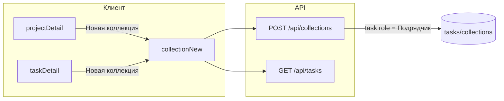

# План: коллекции для внешнего подрядчика

## Контекст

Сейчас подрядчик **не видит** карточку «Новая коллекция» на проекте и ТЗ из‑за одного флага:

```188:189:c:\Users\eQurane\VSCode\mox\client\js\pages\projectDetail.js
  const hideNewCollectionControls =
    roleName === 'Клиент' || roleName === 'Внешний подрядчик';
```

(то же в [`taskDetail.js`](c:\Users\eQurane\VSCode\mox\client\js\pages\taskDetail.js).)

Даже при показе карточки маршруты **`#/project/:id/collections/new`** и **`#/project/:id/tasks/:taskId/collections/new`** в [`app.js`](c:\Users\eQurane\VSCode\mox\client\js\app.js) редиректят подрядчика на `#/home` (стр. 144–152 и 162–171).

На бэкенде [`POST /api/collections`](c:\Users\eQurane\VSCode\mox\server\src\routes\collections.js) допускает только роли из `ROLES_CAN_POST_COLLECTION` (**Админ**, **Менеджер**, **Исполнитель**) — подрядчик получит **403**. Это согласуется с текущей матрицей в [`access-matrix.mdc`](c:\Users\eQurane\VSCode\mox\.cursor\rules\access-matrix.mdc), но **противоречит** продуктовой цели: подрядчик уже может **`POST /api/media`** только в коллекциях ТЗ типа подрядчика — без возможности создать коллекцию UX неполный.

Референс исполнителя: карточка **`buildSectionCreateCard`** → тот же hash, форма в [`collectionNew.js`](c:\Users\eQurane\VSCode\mox\client\js\pages\collectionNew.js); список ТЗ для селекта уже приходит от **`fetchTasks({ projectId })`**, для подрядчика на сервере действует тот же фильтр, что и в [`tasks.js`](c:\Users\eQurane\VSCode\mox\server\src\routes\tasks.js) (`contractorRestricted` + `sqlTaskHasContractorType`).



## 1. Бэкенд: `POST /api/collections`

Файл: [`server/src/routes/collections.js`](c:\Users\eQurane\VSCode\mox\server\src\routes\collections.js).

- Добавить **`Внешний подрядчик`** в множество ролей, которым разрешено создание (расширить `ROLES_CAN_POST_COLLECTION` или эквивалентно разрешить в `requireRoleForNewCollection`).
- После того как найдены `taskId` и `projectId` и проект **виден** через существующий `fetchProjectDatesIfVisible` (членство в `user_project` для не‑админов), для аккаунта с ролью **`Внешний подрядчик`** выполнить **дополнительную проверку**, что задача относится к области подрядчика — reuse **`sqlTaskHasContractorType('t')`** в `WHERE t.id = $taskId` (как в других маршрутах). При несоответствии отвечать **`404`** «Техническое задание не найдено.» — тот же стиль, что при скрытии чужих сущностей у подрядчика.

Так исполнитель по‑прежнему может создавать коллекции к любым ТЗ своего проекта, а подрядчик — **только** к ТЗ с `tasks.role_id` → роль «Внешний подрядчик».

## 2. Фронтенд: карточки и роутер

- [`projectDetail.js`](c:\Users\eQurane\VSCode\mox\client\js\pages\projectDetail.js): задать `hideNewCollectionControls` только для **`Клиент`** (убрать подрядчика из условия). Карточка ведёт на `#/project/:id/collections/new` — уже задано через `hrefCollectionsNew`.
- [`taskDetail.js`](c:\Users\eQurane\VSCode\mox\client\js\pages\taskDetail.js): то же для секции коллекций.
- [`app.js`](c:\Users\eQurane\VSCode\mox\client\js\app.js): в двух ветках `collections/new` добавить **`Внешний подрядчик`** к разрешённым ролям (вместе с Админ/Менеджер/Исполнитель), чтобы не было редиректа на `#/home`.

## 3. Фронтенд: [`collectionNew.js`](c:\Users\eQurane\VSCode\mox\client\js\pages\collectionNew.js)

В сценарии **без** зафиксированного `taskId`, когда **`tasks.length === 0`**:

- Сейчас показывается сообщение и кнопка «Добавить ТЗ» → `#/project/.../tasks/new` — для подрядчика это вводит в заблуждение (создание ТЗ ему запрещено).
- Для `roleName === 'Внешний подрядчик'` заменить призыв на нейтральный текст («Нет доступных технических заданий» / «Обратитесь к менеджеру») и оставить только возврат «К проекту» без ссылки на создание ТЗ.

Остальная логика (селект ТЗ + создание) уже совместима: **`fetchTasks`** для подрядчика вернёт только «свои» ТЗ.

## 4. Документация

Привести в соответствие с поведением:

- [`\.cursor\rules\access-matrix.mdc`](c:\Users\eQurane\VSCode\mox\.cursor\rules\access-matrix.mdc): строка **`POST /api/collections`** для подрядчика (⚠️ с условием: членство + тип ТЗ «Внешний подрядчик»); блок про роль подрядчика при необходимости одной фразой про создание коллекций; таблица **UI**: `#/project/:id/collections/new`, `#/project/:id/tasks/:taskId/collections/new` для подрядчика.
- [`\.cursor\rules\backend-api.mdc`](c:\Users\eQurane\VSCode\mox\.cursor\rules\backend-api.mdc): секция **POST `/api/collections`** — доступ подрядчика и условие по типу ТЗ (аналогично **POST `/api/media`**).
- [`\.cursor\rules\frontend-architecture.mdc`](c:\Users\eQurane\VSCode\mox\.cursor\rules\frontend-architecture.mdc): строки про **`#/project/:id`** и **`#/project/:id/tasks/:taskId`** и маршруты **`collections/new`** — указать подрядчика там, где сейчас только исполнитель.
- [`report/README.md`](c:\Users\eQurane\VSCode\mox\report\README.md): таблица ролей и строка про **`POST /api/collections`** (сейчас для подрядчика стоит «—»).

## 5. Проверка вручную (после реализации)

- Под пользователем **Внешний подрядчик**, членом проекта: на карточке проекта видна «Новая коллекция», форма открывается, в списке ТЗ только ТЗ с типом подрядчика; создание успешно, переход на карточку коллекции.
- С экрана **конкретного** такого ТЗ — карточка «Новая коллекция», тот же успешный сценарий.
- Прямой вызов API с `taskId` «чужого» типа исполнителя (если id известен) — **404**, коллекция не создаётся.
- **Клиент** по-прежнему без карточек и без доступа к API.
