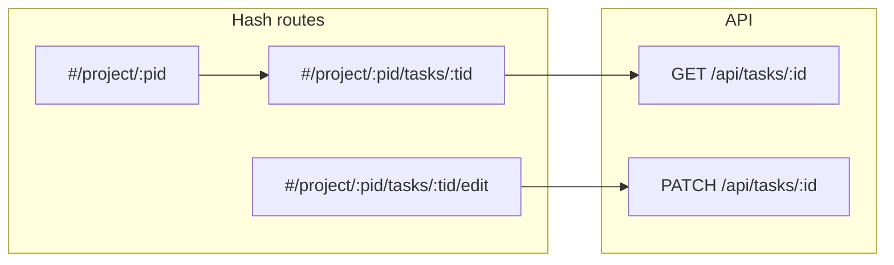

# Просмотр и редактирование задания

## Контекст

- Карточки задания на [client/js/pages/projectDetail.js](client/js/pages/projectDetail.js) уже ведут на `#/project/${projectId}/tasks/${task.id}`, но [client/js/app.js](client/js/app.js) для этого маршрута вызывает [client/js/pages/projectFormStub.js](client/js/pages/projectFormStub.js) (`task-detail`).
- В [server/src/routes/tasks.js](server/src/routes/tasks.js) есть только список, `create-options`, `POST /tasks`; **нет** детальной выдачи и обновления.
- Список задание ([client/js/pages/tasksList.js](client/js/pages/tasksList.js)) сейчас рендерит `article` **без** перехода на карточку задания — логично сделать клик по карточке (или главный заголовок) ссылкой на тот же hash, что и из проекта.

## Бэкенд ([server/src/routes/tasks.js](server/src/routes/tasks.js))

1. **`GET /api/tasks/:id`**
   - Валидация `id` (целое ≥ 1), иначе `400`.
   - **Доступ к чтению:** как у [`GET /api/projects/:id`](server/src/routes/projects.js) для *проекта этой задачи*: **Внешний подрядчик** — `403`; **Админ/Менеджер** — любая задача; **Клиент/Исполнитель** — только если есть активное членство в `user_project` по `tasks.project_id`. Если задача не найдена или проект недоступен — единый **`404`** «Задание не найдено.» (как у проектов).
   - **Тело `200`:** аналог вложенности проекта:
     - `task`: `{ id, projectId, projectName, name, description, deadline, roleId, roleName, statusId, statusName }`
     - `collections`: как в `GET /projects/:id` — `{ id, taskId, name, description, createdAt, lastEditedAt }` **только** для `task_id = :id`
     - `media`: как в `GET /projects/:id` — `{ id, collectionId, path, name, format, description, uploadAt, statusName }` для коллекций этой задачи (JOIN `collections` → `media`).

2. **`PATCH /api/tasks/:id`**
   - Доступ: только **Админ** и **Менеджер** (как `POST /tasks` / `requireManagerOrAdmin`).
   - Видимость записи: задача существует и проект «виден» этому пользователю по тем же правилам, что и `GET` (иначе `404`).
   - Тело: как `POST` без смены проекта — `name`, `description`, `deadline`, `roleId`, `statusId`. Вынести общую проверку дедлайна (в границах `start_date`/`end_date` проекта, `INIT_DATE`, роль из белого списка, статус из `statuses_tasks`) из `POST` во внутреннюю функцию, вызывать из `POST` и `PATCH`.
   - **`200`:** `{ task: { … поля как после создания … } }`.

3. **Порядок маршрутов:** оставить литералы (`/tasks/create-options`, `GET /tasks`) **выше** `GET /tasks/:id`, чтобы не перехватывать список.

## Клиент — API ([client/js/api/tasks.js](client/js/api/tasks.js))

- `fetchTaskById(id)` → `GET /api/tasks/:id`
- `updateTask(id, payload)` → `PATCH /api/tasks/:id`

## Клиент — страницы

1. **[client/js/pages/taskDetail.js](client/js/pages/taskDetail.js)** (новый), по структуре близко к [client/js/pages/projectDetail.js](client/js/pages/projectDetail.js):
   - Шапка: «Назад» → `#/project/${projectId}`; заголовок — название задания; кнопка «Редактировать» — только **Админ/Менеджер** → `#/project/${projectId}/tasks/${taskId}/edit`.
   - Блок полей: название, описание, дедлайн (как `formatDateTimeRu`), роль исполнителя, статус (бейджи/модификаторы можно переиспользовать slug-маппинги из `projectDetail` или вынести в маленький shared-фрагмент — по желанию, без лишнего рефакторинга).
   - **Проект:** имя + ссылка `#/project/${projectId}`.
   - Секция **Коллекции:** заголовок; иконка списка — на `#/collections?projectId=…&taskId=…` (как на карточке проекта); сетка карточек по данным API (аналог `buildCollectionCard`, без лишнего «Задание: …» внутри карточки — одна задача).
   - Секция **Медиа:** заголовок; иконка — на `#/media?projectId=…&taskId=…`; карточки как `buildMediaCard` (превью, статус).
   - Загрузка через `fetchTaskById(taskId)`; сверка `data.task.projectId === Number(projectId)` с сегментом URL — при несоответствии показать сообщение и ссылку «К проекту» / корректный проект.
   - Ошибка `404`/сети — сообщение + «К проекту».

2. **[client/js/pages/taskEdit.js](client/js/pages/taskEdit.js)** (новый), по образцу [client/js/pages/projectEdit.js](client/js/pages/projectEdit.js) + поля из [client/js/pages/taskNew.js](client/js/pages/taskNew.js):
   - Параллельно: `fetchTaskById`, `fetchProjectById(projectId)`, `fetchTaskCreateOptions`.
   - Проверка прав: только **Админ/Менеджер** (как `taskNew`); проверка `task.projectId === projectId`.
   - Префилл полей из `task`; границы `datetime-local` из дат проекта (`toDatetimeLocalMin`/`Max` из [client/js/pages/projectFormShared.js](client/js/pages/projectFormShared.js)).
   - Submit: `updateTask(taskId, { name, description, deadline: ISO, roleId, statusId })`; успех → `#/project/${projectId}/tasks/${taskId}`.
   - Разумная дедупликация с `taskNew`: вынести в **[client/js/pages/taskFormShared.js](client/js/pages/taskFormShared.js)** (новый) общие вещи: `fieldsForTaskApiError`, при необходимости сборку полей формы или только маппинг ошибок — чтобы не копировать большие блоки дважды; `taskNew` можно перевести на импорт оттуда.

3. **[client/js/app.js](client/js/app.js)**
   - Импорт `renderTaskDetailPage`, `renderTaskEditPage`.
   - Заменить вызов заглушки для `project/:id/tasks/:taskId` на `renderTaskDetailPage(appRoot, projectId, taskId)`.
   - Новая ветка `project/:id/tasks/:taskId/edit`: редирект на `#/home`, если не Админ/Менеджер; иначе `renderTaskEditPage(appRoot, projectId, taskId)`.
   - Неизвестные хвосты под `project/...` по-прежнему — «Страница не найдена».

4. **[client/js/pages/tasksList.js](client/js/pages/tasksList.js)** (небольшое изменение)
   - Карточка списка: обернуть в ссылку на `#/project/${projectId}/tasks/${taskId}` (как на странице проекта) или сделать только заголовок ссылкой — предпочтительно повторить паттерн `project-detail` (`project-card--link`) для консистентности.

## Документация (после реализации)

Обновить согласованно:

- [.cursor/rules/backend-api.mdc](.cursor/rules/backend-api.mdc) — таблица эндпоинтов и разделы **`GET /api/tasks/:id`**, **`PATCH /api/tasks/:id`** (права, тело, ответы, коды ошибок).
- [.cursor/rules/backend-architecture.mdc](.cursor/rules/backend-architecture.mdc) — перечень защищённых маршрутов дополнить этими двумя.
- [.cursor/rules/frontend-architecture.mdc](.cursor/rules/frontend-architecture.mdc) — маршруты `#/project/:id/tasks/:taskId`, `#/project/:id/tasks/:taskId/edit`, файлы `taskDetail.js`, `taskEdit.js`, при необходимости `taskFormShared.js`, функции в `api/tasks.js`.
- [.cursor/rules/project-structure.mdc](.cursor/rules/project-structure.mdc) — перечисление новых файлов в `pages/` и расширение описания `tasks.js` на деталь/обновление.

**Не** добавлять отдельные пользовательские README, если вы их не просите — только перечисленные правила.
