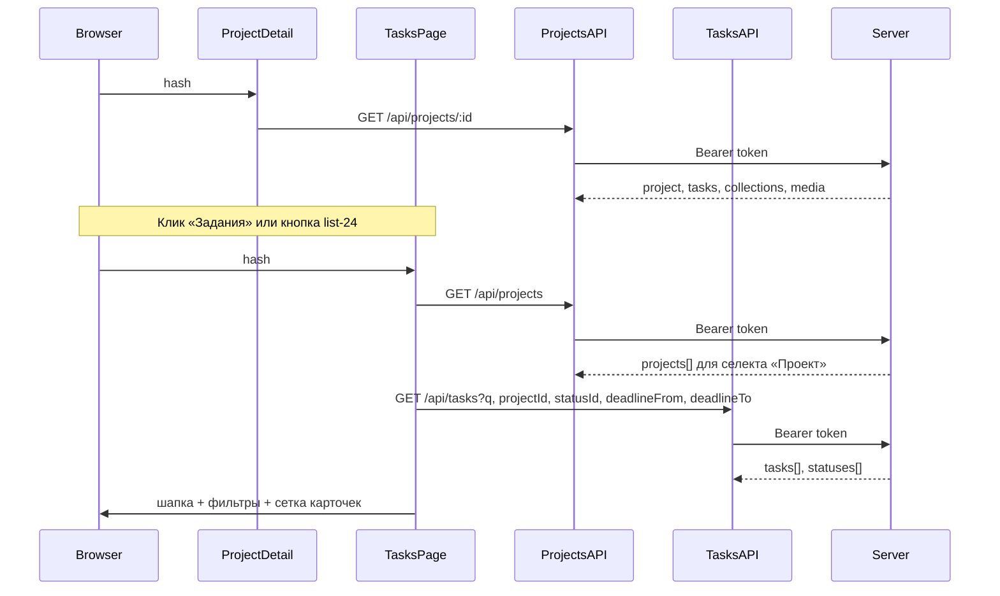

# Страница просмотра всех заданий (задачи)

## Контекст

В доменной модели **Задания соответствуют строкам таблицы `tasks`** ([`database-schema.mdc`](c:/Users/eQurane/VSCode/mox/.cursor/rules/database-schema.mdc)): связь с проектом `project_id`, статус задачи `status_id` → `statuses_tasks`, дата **`deadline`**. Отдельного ресурса «задание» в API сейчас нет — данные задач уже отдаются внутри [`GET /api/projects/:id`](c:/Users/eQurane/VSCode/mox/server/src/routes/projects.js); для глобального списка с фильтрами нужен **новый эндпоинт**.

Карточный паттерн и разметка: как на главной ([`client/js/pages/home.js`](c:/Users/eQurane/VSCode/mox/client/js/pages/home.js) — `.projects-grid`, `.project-card`) и блок задания на проекте ([`client/js/pages/projectDetail.js`](c:/Users/eQurane/VSCode/mox/client/js/pages/projectDetail.js) — `buildTaskCard`, `TASK_STATUS_SLUG`, `.project-card--static`).

## Бэкенд

**Новый роутер** [`server/src/routes/tasks.js`](c:/Users/eQurane/VSCode/mox/server/src/routes/tasks.js) (или аналогичное имя), подключить в [`server/src/server.js`](c:/Users/eQurane/VSCode/mox/server/src/server.js) через `app.use('/api', tasksRouter)` рядом с остальными.

**`GET /api/tasks`** (`requireAuth`):

- **Видимость проектов** — та же, что у [`GET /api/projects`](c:/Users/eQurane/VSCode/mox/server/src/routes/projects.js): `seeAll` для Админ/Менеджер иначе `JOIN user_project` с `excluded_at IS NULL` на проект задачи.
- **Параметры query** (все необязательны; валидация строго, как для дат проектов — уже есть константа `DATE_RE` в `projects.js`, имеет смысл вынести в маленький `server/src/dateValidate.js` **или** скопировать одну строку в `tasks.js`, без лишней абстракции):
  - `q` — подстрока по **`tasks.name`** (`ILIKE`, экранировать `%`/ `_` через замену или `postgresql` `escape`);
  - `projectId` — целое `>= 1`; дополнительное ограничение `WHERE t.project_id = $n` (несуществующий id → пустой список при `200`, без утечки факта существования);
  - `statusId` — целое `>= 1`, существование в `statuses_tasks` (несуществующий → **400** с понятным текстом);
  - `deadlineFrom`, `deadlineTo` — `YYYY-MM-DD` по желанию **диапазон дедлайна** (`deadline::date >= from`, `<= to`); если задан только один конец — отфильтровать с одной гранью; если `from > to` → **400**.
- **Ответ `200`:** `{ tasks: [...], statuses: [{ id, name }] }`:
  - `tasks`: для каждой строки минимум `id`, `projectId`, `projectName`, `name`, `description`, `deadline`, `roleName`, `statusId`, `statusName` — зеркально полям из [`GET /api/projects/:id`](c:/Users/eQurane/VSCode/mox/server/src/routes/projects.js) плюс идентификатор статуса и проект для карточки/ссылок.
  - `statuses`: `SELECT id, name FROM statuses_tasks ORDER BY id` — один раз в ответе для селекта «Статус» на клиенте (без лишнего запроса).
- Ошибки: `401`, `400` (валидация), `500`.

**Вне scope:** глобальные списки коллекций и медиа (`GET /api/collections`, `GET /api/media`, `#/collections`, `#/media`) — возможная следующая итерация.

## Диаграмма потока

## Клиент: API-слой

[**`client/js/api/tasks.js`**](c:/Users/eQurane/VSCode/mox/client/js/api/tasks.js) — `fetchTasks({ … })` с `URLSearchParams`; `Bearer`, `parseJsonSafe`, русские ошибки по образцу [`projects.js`](c:/Users/eQurane/VSCode/mox/client/js/api/projects.js).

## Главная: навигация по разделам

В [`client/js/pages/home.js`](c:/Users/eQurane/VSCode/mox/client/js/pages/home.js) в блоке навигации шапки добавить **две** навигационные ссылки того же семейства стилей, что и «Администрирование» (`app-header__tab`):

| Подпись     | Назначение |
|-------------|------------|
| **Проекты** | `#/home` — дашборд с карточками проектов; на этом маршруте — **активное** состояние (`.app-header__tab--current` или экв.). |
| **Задания**      | `#/tasks` — список всех заданий. |

Пункты «Коллекции» и «Медиа» **не добавлять** на этом этапе.

Общий паттерн двух вкладок вынести для **повторного использования в шапке** [`tasksList.js`](c:/Users/eQurane/VSCode/mox/client/js/pages/tasksList.js) (можно маленый хелпер в отдельном модуле `js/nav/dashboardTabs.js` или дублирование разметки — на усмотрение, без раздувания области).

## Клиент: роутинг и deep link

В [`client/js/app.js`](c:/Users/eQurane/VSCode/mox/client/js/app.js):

1. Разделить hash на **path** и **query** (например `#/tasks?projectId=5` → path `tasks`, `URLSearchParams`).
2. В `isProtectedRoute` включить только **`tasks`** (дополнительно к уже защищённым маршрутам).
3. Ветка `segs[0] === 'tasks'` → `renderTasksPage(appRoot, { searchParams })` (имя экспорта — по договорённости при реализации).

**Query:** `#/tasks?projectId=<id>` задаёт начальный фильтр «Проект»; при смене фильтров — `history.replaceState` для сохранения в hash.

Дополнительные входы: **главная** (см. выше); **со страницы проекта** для задания — как в следующем разделе.

## Клиент: страница списка заданий

**[`client/js/pages/tasksList.js`](c:/Users/eQurane/VSCode/mox/client/js/pages/tasksList.js)**

- Каркас: `main.dashboard`, шапка с **двумя** вкладками (**Проекты · Задания**) как на главной, активна **Задания**; заголовок «Задания»; опционально кнопка «Назад» на `#/home`; при необходимости ссылка «К проектам».
- Загрузка:
  - `fetchProjects()` — опции селекта «Проект» (список уже ограничен правами пользователя).
  - `fetchTasks(…)` — сетка + `statuses` для второго селекта.
- **Панель фильтров:** поле поиска по названию (иконка как на главной, классы можно переиспользовать или добавить узкий блок `tasks-filters`), `<select>` проектов (первая опция «Все проекты»), `<select>` статусов из ответа (первая опция «Все статусы»), два `<input type="date">` — дедлайн с / по (вы выбрали именно диапазон).
- При изменении фильтров — повторный `fetchTasks` (для текстового поиска — короткий **debounce** ~300 ms, чтобы не ддосить API).
- **Синхронизация URL (рекомендуется):** при смене фильтров делать `history.replaceState` с актуальным hash query (хотя бы `projectId` и при желании остальные), чтобы ссылку можно было скопировать; начальное состояние читать из `searchParams` при входе.
- Сетка: `.projects-grid`, карточки по образцу `buildTaskCard` из `projectDetail.js` с дополнением: строка **`Проект: …`** со ссылкой на `#/project/<projectId>`; карточка остаётся нессылочной или вся карточка-ссылка на проект — на усмотрение, главное не ломать визуальную систему статус-бейджей (`TASK_STATUS_SLUG` / модификаторы `--status-*`).
- Пустой список: блок в стиле `.projects-empty` / `.projects-empty--inline`.
- Обработка ошибок: `.message.message_error`, `aria-live` где уместно.

## Точка входа со страницы проекта (задания)

В [`client/js/pages/projectDetail.js`](c:/Users/eQurane/VSCode/mox/client/js/pages/projectDetail.js) секция задание сейчас использует [`sectionHeading(hrefTasks, 'Задания')`](c:/Users/eQurane/VSCode/mox/client/js/pages/projectDetail.js), где `hrefTasks` указывает на `#/project/:id/tasks/new`.

**Изменить поведение:**

1. Заголовок **«Задания»** (кликабельная надпись) вести на **`#/tasks?projectId=<текущий projectId>`** — экран просмотра всех заданий с предвыбранным проектом.
2. Справа от заголовка в одном ряду (`project-detail__section-title` или обёртка-`flex`) добавить **кнопку** (например `button button-ghost button-icon`, `aria-label` вроде «Список всех заданий проекта») с иконкой [`client/icons/list-24.svg`](c:/Users/eQurane/VSCode/mox/client/icons/list-24.svg) — тот же **`#/tasks?projectId=…`**.
3. Ссылку на создание нового задание **не удалять**: карточка **«Добавить задание»** при пустой сетке и существующий маршрут `#/project/:id/tasks/new` остаются; при необходимости добавить вторичную точку перехода к `#/project/…/tasks/new` (например небольшая текстовая ссылка «Добавить задание», если секция уже не ведёт на new через заголовок).

Итого: два элемента (надпись + кнопка-список) ведут на список заданий с отфильтрованным проектом.

## Стили

В [`client/styles/main.css`](c:/Users/eQurane/VSCode/mox/client/styles/main.css) — блок раскладки фильтров (flex/grid), отступы; раскладка **ряда заголовка секции заданий** (flex, выравнивание `h2` + кнопка с иконкой, не ломая остальные секции).

## Документация правил (**обязательно** после завершения реализации)

Синхронизировать:

- [`backend-api.mdc`](c:/Users/eQurane/VSCode/mox/.cursor/rules/backend-api.mdc) — только `GET /api/tasks`: query, ответ, ошибки, видимость как у списка проектов.
- [`frontend-architecture.mdc`](c:/Users/eQurane/VSCode/mox/.cursor/rules/frontend-architecture.mdc) — маршрут `#/tasks`, разбор hash query, [`tasks.js`](c:/Users/eQurane/VSCode/mox/client/js/api/tasks.js), [`tasksList.js`](c:/Users/eQurane/VSCode/mox/client/js/pages/tasksList.js); шапка с **Проекты · Задания** на главной и на экране задания; вход с проекта на `#/tasks?projectId=…` (заголовок + `list-24.svg`).

## Краткий чеклист файлов

| Действие | Файл |
|----------|------|
| Создать | `server/src/routes/tasks.js` |
| Изменить | `server/src/server.js` |
| Создать | `client/js/api/tasks.js` |
| Создать | `client/js/pages/tasksList.js` |
| Изменить | `client/js/app.js` |
| Изменить | `client/js/pages/home.js` (табы навигации) |
| Изменить | `client/js/pages/projectDetail.js` (секция заданий) |
| Изменить | `client/styles/main.css` |
| Изменить | `.cursor/rules/backend-api.mdc`, `frontend-architecture.mdc` |
