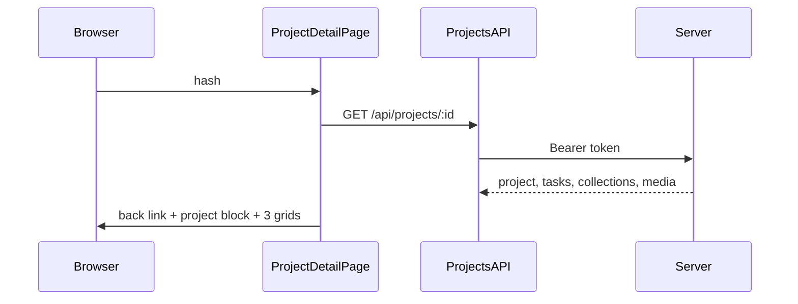

# Форма просмотра проекта (задания, коллекции, медиа)

## Контекст

- Сейчас [`client/js/pages/projectDetail.js`](client/js/pages/projectDetail.js) — заглушка «Раздел в разработке».
- Данные в БД: **проект** → **задачи** (`tasks`) → **коллекции** (`collections`) → **медиа** (`media`) — см. [`database-schema.mdc`](.cursor/rules/database-schema.mdc) / [`server/db_init/init.js`](server/db_init/init.js). Отдельной сущности «задание» нет; в UI разумно подписать раздел **«Задания»** или **«Задания»** и выводить строки из `tasks`.
- Права как у [`GET /api/projects`](server/src/routes/projects.js): **Админ/Менеджер** — любой проект; остальные — только при участии в `user_project` с `excluded_at IS NULL`.
- Карточный паттерн дашборда: [`client/js/pages/home.js`](client/js/pages/home.js) (`buildProjectCard`, `.projects-grid`, `.project-card`, статусы через `statusSlug`) и стили в [`client/styles/main.css`](client/styles/main.css) (строки ~522–747).

## Бэкенд: `GET /api/projects/:id`

**Файл:** [`server/src/routes/projects.js`](server/src/routes/projects.js).

1. **Порядок маршрутов:** оставить `GET /projects/create-options` **выше** нового `GET /projects/:id`, чтобы сегмент `create-options` не воспринимался как `id`.
2. **Валидация:** `id` — целое `>= 1`; иначе `400`.
3. **Доступ:** повторить логику `seeAll` + `JOIN user_project` (как в списке). Если проект не найден или доступа нет — **единый ответ `404`** с текстом вида «Проект не найден.» (без различия «нет записи» / «нет прав», как часто для закрытых сущностей).
4. **Данные проекта:** те же поля, что в списке: `id`, `name`, `goal`, `startDate`, `endDate`, `statusName`, `coverPath` (подзапрос «последнее медиа по проекту» можно скопировать из текущего `GET /projects`).
5. **Вложенность в ответе (собрать в JS после 2–4 SQL-запросов без N+1):**
   - все `tasks` проекта: `id`, `name`, `description`, `deadline`, `roleName` (join `roles`), `statusName` (join `statuses_tasks`);
   - все `collections` для этих `task_id`: `id`, `taskId`, `name`, `description`, `createdAt`, `lastEditedAt`;
   - все `media` для этих `collection_id`: `id`, `collectionId`, `path`, `name`, `format`, `description`, `uploadAt`, `statusName` (join `statuses_media`).
6. **Форма JSON:** например `{ project, tasks, collections, media }` с плоскими массивами `collections`/`media` и связью по `taskId`/`collectionId` — фронт сам соберёт три «списка» для сеток и сможет показать на карточках подписи «Задание: …» / «Коллекция: …».

Альтернатива — один вложенный объект `tasks[].collections[].media[]`; она тяжелее для трёх отдельных сеток (придётся разворачивать). **Рекомендация:** плоские `collections` и `media` + `project` + `tasks`.

## Клиент: API

**Файл:** [`client/js/api/projects.js`](client/js/api/projects.js).

- Добавить `fetchProjectById(id)` с `Bearer`, `parseJsonSafe`, русские сообщения об ошибках по образцу `fetchProjects`.

## Клиент: страница деталей

**Файл:** [`client/js/pages/projectDetail.js`](client/js/pages/projectDetail.js).

1. **Каркас:** `main` с классом в духе дашборда (например `dashboard` + модификатор `project-detail`), чтобы наследовать ширину/фон; шапка с кнопкой «Назад» на `#/home` и иконкой как в [`projectNew.js`](client/js/pages/projectNew.js) (`/icons/back-24.svg`).
2. **Загрузка:** `async` рендер, вызов `fetchProjectById`, при ошибке — `.message.message_error` и ссылка «К проектам».
3. **Блок проекта:** крупный заголовок (`name`), цель (`goal`), период (формат дат как `formatDateRu` в `home.js`), бейдж статуса проекта (те же `STATUS_SLUG` / классы бейджей). Опционально обложка `coverPath` (тот же приём с placeholder, что в `buildProjectCard`).
4. **Три секции** с заголовками h2 и контейнером `.projects-grid` (как на дашборде):
   - **Задание:** карточки по `tasks` — название, краткое описание (clamp 2–3 строки), дедлайн, бейдж статуса задачи, при необходимости роль. Классы: база `.project-card` + модификатор **не ссылка** (например `.project-card--static` или `article` + отключение `hover` для неинтерактивных).
   - **Коллекции:** карточки по `collections` — имя, описание, даты; подзаголовок/строка `.project-card__muted` с привязкой к задание (имя задачи по `taskId`).
   - **Мультимедиа:** карточки по `media` — превью: если `path` похож на картинку по `format`/расширению — `img`, иначе плейсхолдер как у проекта без обложки; имя файла, формат, дата загрузки, бейдж `statusName`; мелким текстом связь с коллекцией/задание.
5. **Пустые состояния:** для каждой сетки — блок в стиле `.projects-empty` / `.projects-empty--inline` («Пока нет задач» и т.д.), как на дашборде при пустом поиске.

Вынести общие хелперы (`el`, `formatDateRu`, маппинг статусов) либо дублировать минимально в файле страницы (как сейчас в разных pages), либо при желании один общий `js/utils/dom.js` — **в рамках задачи достаточно локальных функций в `projectDetail.js`**, чтобы не раздувать объём.

## Стили

**Файл:** [`client/styles/main.css`](client/styles/main.css).

- Секции: отступы между блоком проекта и сетками; заголовок секции (например `.project-detail__section-title`).
- **Карточки без навигации:** модификатор для `.project-card` (например `.project-card--static { cursor: default; }` и ослабленный или отключённый hover), чтобы визуально совпадать с дашбордом, но не выглядеть как ссылки.
- При необходимости **мелкий вариант сетки** для плотных списков: опциональный класс на grid (`minmax` чуть меньше) — только если карточки медиа визуально перегружают строку.

## Документация после изменений (обязательно)

После внесения кода синхронизировать правила в [`.cursor/rules/`](.cursor/rules/):

- **[`backend-api.mdc`](.cursor/rules/backend-api.mdc):** добавить раздел **`GET /api/projects/:id`** — заголовок Bearer, правила видимости (как у `GET /api/projects`), коды **`400`** / **`404`** / **`500`**, форма тела ответа (`project`, `tasks`, `collections`, `media` и имена полей в camelCase, согласованные с реализацией).
- **[`frontend-architecture.mdc`](.cursor/rules/frontend-architecture.mdc):** обновить описание экрана **`projectDetail.js`** — не заглушка, а загрузка `fetchProjectById`, блок сведений о проекте и три карточные сетки (задания/задачи, коллекции, медиа); при необходимости одна строка про `fetchProjectById` в разделе API-слоя.

Схему БД ([`database-schema.mdc`](.cursor/rules/database-schema.mdc)) менять **только** если по ходу реализации меняется DDL или seed; для этой задачи обычно достаточно первых двух файлов.

## Диаграмма потока

В том же стиле, что [план дашборда](.cursor/plans/projects_dashboard_after_login_ca6b0d40.plan.md): последовательность взаимодействий браузера, страницы, клиентского API и сервера.

## Итог

| Слой | Изменения |
|------|-----------|
| Сервер | Новый маршрут, проверка доступа, выборка project + tasks + collections + media |
| `projects.js` API | `fetchProjectById` |
| `projectDetail.js` | Полноценный экран с шапкой, инфо проекта, 3× `.projects-grid` |
| `main.css` | Секции деталей, статичные карточки при необходимости |
| Документация | `backend-api.mdc`, при необходимости `frontend-architecture.mdc` |
