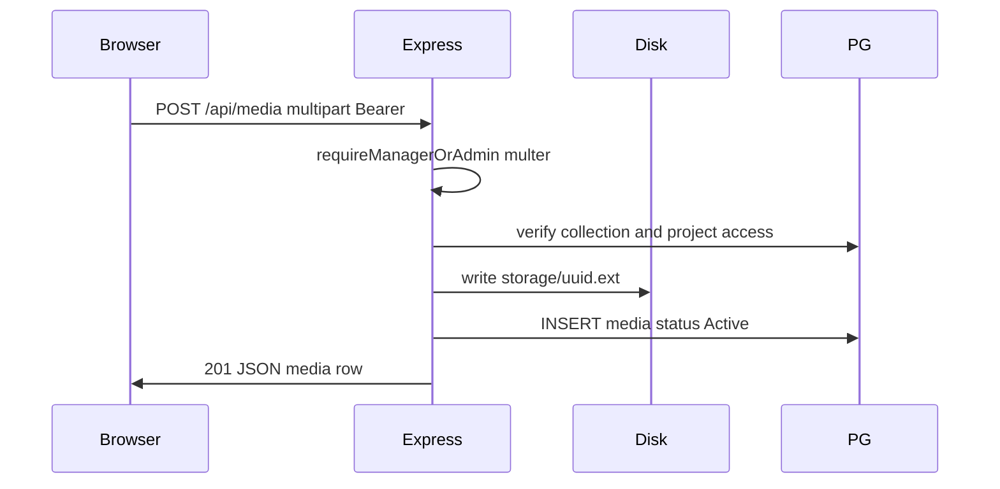

# Форма добавления медиа в коллекцию

## Контекст

- Роут уже есть: [`app.js`](client/js/app.js) (`#/project/:projectId/media/new`, query `collectionId` из [`collectionDetail.js`](client/js/pages/collectionDetail.js)), но вызывается **заглушка** [`renderProjectFormStub`](client/js/pages/projectFormStub.js).
- Бэкенд: [`server/src/routes/media.js`](server/src/routes/media.js) содержит только **`GET /api/media`**; зависимости без `multer` ([`server/package.json`](server/package.json)).
- Поле `media.path` в ответах API используется клиентом как **URL для ``** ([`mediaList.js`](client/js/pages/mediaList.js) и др.), значит в БД нужно сохранять **публичный путь** вида `/storage/...`, а каталог на диске — от корня репозитория **`storage/`** (как вы указали), с раздачей через Express.
- Статус в БД: в справочнике первый статус — **«Активный»** ([`database-schema.mdc`](.cursor/rules/database-schema.mdc)); при вставке брать `status_id` по имени **`Активный`** (не полагаться на «id = 1»).

## Права доступа

- Создание коллекций на сервере — только **Админ / Менеджер** (`requireManagerOrAdmin` в [`collections.js`](server/src/routes/collections.js)).
- На экране коллекции кнопка «Добавить медиа» уже только для админа/менеджера ([`collectionDetail.js`](client/js/pages/collectionDetail.js)); на проекте и ТЗ кнопка показывается всем, кроме клиента — при текущей модели API исполнитель получит **403**.
- **Рекомендация в рамках задачи:** для `POST /api/media` использовать ту же политику, что и `POST /api/collections` (**только Админ / Менеджер**), и в [`app.js`](client/js/app.js) добавить **такой же редирект**, как у `#/project/:id/collections/new`, для `#/project/:id/media/new`. Дополнительно сузить кнопки «Добавить медиа» в [`projectDetail.js`](client/js/pages/projectDetail.js) и [`taskDetail.js`](client/js/pages/taskDetail.js) до **Админ / Менеджер** — чтобы не вести пользователя на форму, которая завершится ошибкой прав.

## Сервер

1. **Каталог и статика**
   - Корень хранилища: `path.join(__dirname, '..', '..', 'storage')` относительно [`server/src/server.js`](server/src/server.js) (это каталог `storage/` в корне репозитория).
   - Создавать каталог при старте, если отсутствует (`fs.mkdir` с `{ recursive: true }`).
   - `app.use('/storage', express.static(storageDir))` — **до** или **после** `/api` без разницы; путь не конфликтует с `/api`.
   - Добавить **`storage/`** в [`.gitignore`](.gitignore).

2. **Загрузка файла**
   - Зависимость **`multer`** с `diskStorage`: уникальное имя файла (например `crypto.randomUUID()` + безопасное расширение из оригинального имени), безопасный basename (убрать path traversal).
   - Один обработчик **`POST /api/media`**: `requireAuth` → **`requireManagerOrAdmin`** (скопировать паттерн из [`collections.js`](server/src/routes/collections.js)) → `multer.single('file')`.
   - Поля multipart (текстовые): **`collectionId`** (integer), **`description`** (строка, допускается пустая).

3. **Валидация и INSERT**
   - По `collectionId`: `SELECT c.id, t.project_id FROM collections c JOIN tasks t ON t.id = c.task_id WHERE c.id = $1`.
   - Проверить доступ к проекту так же, как при создании коллекции: использовать ту же логику, что **`fetchProjectDatesIfVisible`** в [`collections.js`](server/src/routes/collections.js) (либо вынести общий хелпер в небольшой модуль — только если хотите избежать дублирования; иначе локальный запрос с тем же SQL-допуском к проекту).
   - Получить **`status_id`** для имени **`Активный`** из `statuses_media`.
   - Поля записи: `path` = `/storage/<имя_файла_на_диске>`, `name` = оригинальное имя файла (trim), `format` = расширение **до 10 символов** (как в схеме `VARCHAR(10)`), `description`, `upload_at = NOW()`, `status_id`, `collection_id`.
   - Ответ **`201`**: объект медиа в том же духе, что строки в `GET /api/media` (минимум поля, нужные клиенту при желании показать результат).

## Синхронизация документации

После реализации фичи обновить правила Cursor так, чтобы они совпадали с кодом (без «опционально» — это часть задачи).

- **[`.cursor/rules/backend-api.mdc`](.cursor/rules/backend-api.mdc)** — в блоке эндпоинтов добавить **`POST /api/media`**; отдельная секция **`POST /api/media`**: `multipart/form-data`, поля **`file`** (один файл), **`collectionId`**, **`description`**; заголовок **`Authorization: Bearer`**; доступ **Админ / Менеджер** (`403` для прочих); коды **`201` \| `400` \| `401` \| `403` \| `404` \| `500`**; тело ответа **`201`** (поля созданной записи); ошибки валидации и «коллекция не найдена / нет доступа к проекту». В преамбуле при необходимости одной фразой: для этого метода тело не JSON, а multipart (остальной API по-прежнему JSON).

- **[`.cursor/rules/backend-architecture.mdc`](.cursor/rules/backend-architecture.mdc)** — в списке защищённых маршрутов добавить **`POST /api/media`** рядом с **`GET /api/media`**.

- **[`.cursor/rules/frontend-architecture.mdc`](.cursor/rules/frontend-architecture.mdc)** — описать **`#/project/:id/media/new`**: **`mediaNew.js`**, **`renderMediaNewPage(..., searchParams)`**, только **Админ / Менеджер** (как создание коллекции); диплинк **`?collectionId=`**; заменить упоминание **`projectFormStub`** для «Добавить медиа» на **`mediaNew`**. В слое API для **`media.js`** добавить **`uploadMedia`** (FormData + Bearer). В дереве **`pages/`** включить **`mediaNew.js`**.

- **[`.cursor/rules/project-structure.mdc`](.cursor/rules/project-structure.mdc)** — **`server/src/server.js`**: раздача статики **`/storage`** и каталог **`storage/`** в корне репозитория; **`src/routes/media.js`**: **`GET`** и **`POST /media`**; **`media.js`**: **`fetchMedia`**, **`uploadMedia`**; в **`js/pages/`** — **`mediaNew`**.

**Необязательно:** [`.cursor/rules/database-schema.mdc`](.cursor/rules/database-schema.mdc) менять только если появятся изменения схемы БД; для текущего плана INSERT в существующую таблицу **`media`** достаточно уже описанных полей.

## Клиент

1. **Новая страница** [`client/js/pages/mediaNew.js`](client/js/pages/mediaNew.js) (экспорт `renderMediaNewPage(container, projectId, searchParams)`):
   - Шапка и «назад» по образцу [`collectionNew.js`](client/js/pages/collectionNew.js): если в query есть валидный `collectionId`, кнопка «назад» ведёт на `#/project/:id/collections/:collectionId`, иначе — на проект.
   - **`fetchProjectById(projectId)`** — проверка доступа и контекста проекта (как на других формах).
   - **`fetchCollections({ projectId })`** — список коллекций **этого проекта** для `<select>` (подписи: имя коллекции + контекст ТЗ из полей ответа API при необходимости).
   - Prefill: если `searchParams.get('collectionId')` совпадает с одной из загруженных коллекций — выставить выбранной по умолчанию; иначе первая коллекция или пустое значение с подсказкой «Выберите коллекцию».
   - Зона **drag-and-drop** + скрытый `<input type="file" multiple>` + видимая кнопка «Выбрать файлы»; `preventDefault` на `dragover`/`drop`.
   - **Вертикальный список** элементов очереди: имя файла (и мини-превью для изображений через `URL.createObjectURL`, с `revokeObjectURL` при удалении), **`textarea`** описания, **`select`** коллекции (значение подставляется из префила URL, пользователь может сменить), кнопка удаления из очереди с иконкой **`/icons/close-24.svg`** ([`client/icons/close-24.svg`](client/icons/close-24.svg)).
   - Кнопка **«Загрузить»**: для каждого элемента — `FormData` (`file`, `collectionId`, `description`) → новый метод API; блокировка формы на время загрузки; по очереди или параллельно с ограничением — на усмотрение (последовательно проще для отображения ошибок по файлу).
   - После успешной загрузки всех — переход на `#/project/:id/collections/:firstCollectionId` или список медиа проекта; разумный дефолт: **страница коллекции**, если все файлы ушли в одну коллекцию, иначе **`#/media?projectId=`** или карточка проекта.

2. **API-обёртка** [`client/js/api/media.js`](client/js/api/media.js): функция **`uploadMedia({ file, collectionId, description })`** — `fetch` с **`Authorization`** и **без** `Content-Type` (браузер выставит boundary для `FormData`).

3. **Роутер** [`client/js/app.js`](client/js/app.js): импорт `renderMediaNewPage`; для ветки `media/new` — проверка роли **Админ / Менеджер** и вызов **`renderMediaNewPage(appRoot, id, searchParams)`** вместо `renderProjectFormStub`.

4. **Стили** [`client/styles/main.css`](client/styles/main.css): классы для drop-зоны (рамка, hover), списка строк, выравнивания полей — в духе существующих форм (`register-card`, `field`, кнопки).

5. **Заглушка:** вариант `media-new` в [`projectFormStub.js`](client/js/pages/projectFormStub.js) можно удалить или оставить неиспользуемым после переключения роутера (предпочтительно убрать мёртвый текст из `COPY`, чтобы не плодить расхождения).

## Риски и краевые случаи

- **Очень длинные имена файлов** — обрезать stored `name` при необходимости или полагаться на БД `TEXT`.
- **Размер файла** — при желании ограничить через `limits` у multer и переменную окружения.
- **Частичный провал** при нескольких файлах — показывать, какие загрузились, какие нет; при пофайловых POST уже есть естественная гранулярность.
