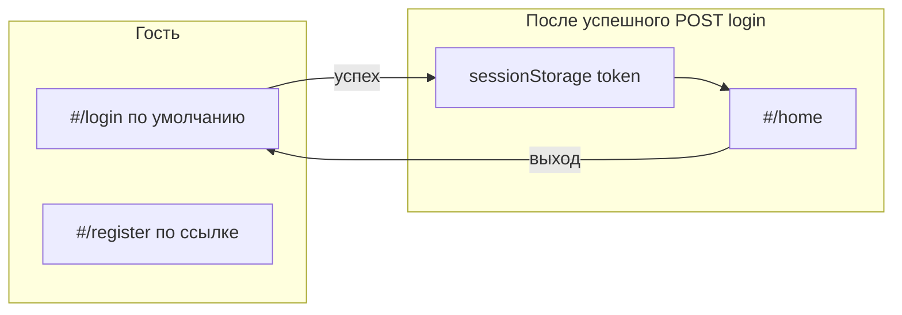

# План: форма логина и стартовая страница для гостя

## Контекст

- Роутинг: hash в `[client/js/app.js](c:\Users\eQurane\VSCode\mox\client\js\app.js)`, сейчас пустой hash нормализуется в `register` и `replaceState` на `#/register`.
- API: в `[client/js/api/auth.js](c:\Users\eQurane\VSCode\mox\client\js\api\auth.js)` только `register` / `register-options`; на сервере `[server/src/routes/auth.js](c:\Users\eQurane\VSCode\mox\server\src\routes\auth.js)` — только регистрация, **сессий/JWT нет** (`[backend-architecture.mdc](c:\Users\eQurane\VSCode\mox\.cursor\rules\backend-architecture.mdc)`).
- UI: паттерн страницы — DOM через локальный `el()`, карточка `.register-card` / форма в `[client/js/pages/register.js](c:\Users\eQurane\VSCode\mox\client\js\pages\register.js)`; стили в `[client/styles/main.css](c:\Users\eQurane\VSCode\mox\client\styles\main.css)`.

## Архитектура потока

## Сервер

1. **Зависимость:** `jsonwebtoken` в `[server/package.json](c:\Users\eQurane\VSCode\mox\server\package.json)` (после согласования плана — `npm install jsonwebtoken` в `server/`).
2. **Переменные окружения** (упомянуть в `.env` / документации при необходимости): `JWT_SECRET` (обязателен в проде), опционально `JWT_EXPIRES_IN` (например `7d`).
3. `**POST /api/auth/login`** в `[server/src/routes/auth.js](c:\Users\eQurane\VSCode\mox\server\src\routes\auth.js)`:
  - Тело: `email`, `password` (те же правила по email, что при регистрации).
  - Запрос в БД: пользователь по `LOWER(trim(email))`, с JOIN на `statuses_users` и `roles` (или два запроса) чтобы получить `status name` и `role_id`.
  - Если пользователя нет или `bcrypt.compare` неуспешен — **одинаковое** сообщение на русском, например «Неверный email или пароль.» (`401`), без раскрытия факта существования email.
  - Статус: разрешить вход только если статус **«Активный»** (как при регистрации по умолчанию задаётся `REGISTER_USER_STATUS`). Для **«Отключён»** — `403` с понятным текстом; для **«На подтверждении»** — `403` с текстом вроде «Учётная запись ещё не активирована.»
4. `**GET /api/auth/me`**:
  - Заголовок `Authorization: Bearer <token>`.
  - Верификация JWT, загрузка актуальных `id, name, email, role_id` из `users` (или минимум полей из payload, если хватит — лучше из БД для консистентности).
  - `401` при отсутствии/невалидном токене.
5. **JWT payload:** минимум `sub` = `user_id`, краткий `exp`; при желании `roleId` для будущих проверок (не обязательно дублировать всё в токене).

## Клиент

1. **Хранение сессии:** модуль `[client/js/auth/session.js](c:\Users\eQurane\VSCode\mox\client\js\auth\session.js)` (новый): ключи `sessionStorage` (например `mox_token`, `mox_user` как JSON снимок с сервера), функции `getToken`, `setSession`, `clearSession`, `isLoggedIn`. Выход — `clearSession` + переход на `#/login`.
2. **API** в `[client/js/api/auth.js](c:\Users\eQurane\VSCode\mox\client\js\api\auth.js)`:
  - `login({ email, password })` → `POST /api/auth/login`, при успехе вернуть `{ token, user }`.
  - `fetchMe()` → `GET /api/auth/me` с `Authorization: Bearer ${getToken()}` (импорт из `session.js` или передача токена аргументом — как удобнее без циклических импортов; при необходимости `fetchMe(token)`).
3. **Страница логина** `[client/js/pages/login.js](c:\Users\eQurane\VSCode\mox\client\js\pages\login.js)`:
  - Та же визуальная оболочка, что у регистрации (можно переиспользовать классы `.register-card`, `.register-form`, `.field`, `.button.primary`).
  - Поля: email, пароль; кнопка «Войти»; ссылка «Нет аккаунта? Зарегистрироваться» → `#/register`.
  - Обработка ошибок через `.message` / `.message_error`, `aria-live`, блокировка кнопки на время запроса.
4. **Страница после входа** `[client/js/pages/home.js](c:\Users\eQurane\VSCode\mox\client\js\pages\home.js)`:
  - При монтировании: если нет токена — возврат/редиект обработает роутер; опционально `fetchMe()` для проверки токена, при `401` — очистить сессию и уйти на логин.
  - Текст: приветствие с именем и email; кнопка «Выйти».
5. **Роутер** `[client/js/app.js](c:\Users\eQurane\VSCode\mox\client\js\app.js)`:
  - Импорт `isLoggedIn` (или `getToken`) из `session.js`.
  - Пустой hash / `#` → `**replaceState` на `#/login`** (не `register`).
  - Ветки: `login`, `register`, `home`, 404 как сейчас.
  - **Гость:** доступны `login` и `register`. Если запрошен `home` без сессии — `replaceState` на `#/login`.
  - **Авторизованный:** при заходе на `login` или `register` — по желанию оставить регистрацию доступной или редирект на `home` только для `login`; разумный минимум: с `login` на `home`, `register` оставить доступной для демо/новых пользователей.
  - Порядок: нормализовать путь, применить редиректы, затем `render…Page(appRoot)`.
6. `**index.html`:** заголовок страницы сузить до нейтрального «Mox» (или «Mox — вход»), чтобы не было только «регистрация».

## Документация правил

После реализации обновить `[.cursor/rules/backend-api.mdc](c:\Users\eQurane\VSCode\mox\.cursor\rules\backend-api.mdc)` и упоминание в `backend-architecture` про JWT — не блокер для работы кода.

## Риски / примечания

- JWT в `sessionStorage` уязвим для XSS — для продакшена позже имеет смысл httpOnly cookie + `credentials: 'include'` и настройка CORS; в плане остаёмся на простом варианте, согласованном со стеком.
- Обязательно задать сильный `JWT_SECRET` в окружении перед выкладкой.

