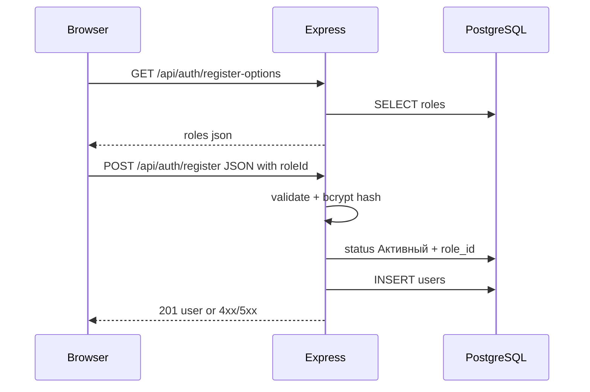

# План: форма регистрации (клиент + API)

## Контекст

- Бэкенд: [server/src/server.js](c:\Users\eQurane\VSCode\mox\server\src\server.js) — только `GET /api/health*` через [server/src/routes/health.js](c:\Users\eQurane\VSCode\mox\server\src\routes\health.js); пул БД уже есть в [server/src/db.js](c:\Users\eQurane\VSCode\mox\server\src\db.js).
- Схема `users` в [server/db_init/init.js](c:\Users\eQurane\VSCode\mox\server\db_init\init.js): `name`, `email` (unique), `password`, `registered_at`, `status_id`, `role_id`. Сиды создают статусы (**«На подтверждении»**, **«Активный»**, **«Отключён»**) и роли из `ROLE_SEEDS` (Админ, Менеджер, Исполнитель, Внешний подрядчик, Клиент).
- **Клиента пока нет** — структура с нуля: `index.html`, `styles/`, `js/` (`api/`, `pages/`, `app.js`), `fetch`, без inline-стилей и без `onclick` в разметке.

**Принятые решения:**

- При регистрации пользователь **выбирает роль** из списка, который приходит с сервера (актуальные строки таблицы `roles`), например выпадающий список по `roleId`.
- На раннем этапе разработки новый пользователь получает статус **«Активный»** (не «На подтверждении»). Имя статуса зашить константой в коде регистрации (или `REGISTER_USER_STATUS=Активный` в `.env`), чтобы позже без логической переделки переключить на «На подтверждении» для продакшена.
- Ответ после успеха: `201` + JSON с публичными полями (`id`, `name`, `email`, `roleId` и/или имя роли — по удобству), без пароля; JWT не входит в объём.
- Хеш пароля: **`bcryptjs`**.

**Безопасность (зафиксировать в комментарии в коде):** сейчас любой может зарегистрироваться с любой ролью, включая «Админ» — это осознанно для dev. Перед продом ограничить whitelist ролей для публичной регистрации или убрать выбор и выдавать роль по политике.

## Бэкенд

1. **Зависимости** — [server/package.json](c:\Users\eQurane\VSCode\mox\server\package.json): `bcryptjs`.

2. **Маршруты** — [server/src/routes/auth.js](c:\Users\eQurane\VSCode\mox\server\src\routes\auth.js) (или разнести по файлам при росте):
   - `GET /auth/register-options` → JSON `{ roles: [{ id, name }] }` (`SELECT id, name FROM roles ORDER BY id`), без секретов.
   - `POST /auth/register` — тело: `{ name, email, password, roleId }` (число).
   - Валидация: непустые поля, email, пароль ≥ 8 символов; `roleId` — целое; проверка `SELECT 1 FROM roles WHERE id = $1`, иначе `400`.
   - Логика: нормализация email (например `trim` + lower case); `bcryptjs.hash`; `status_id` из `statuses_users` WHERE `name = 'Активный'` (константа/переменная окружения для будущего переключения); `INSERT` в `users`; дубликат email → `409`.

3. **Подключение** — [server/src/server.js](c:\Users\eQurane\VSCode\mox\server\src\server.js): `app.use('/api', authRouter)` и `express.static` на [client/](c:\Users\eQurane\VSCode\mox\client).

## Фронтенд (vanilla SPA)

1. **[client/index.html](c:\Users\eQurane\VSCode\mox\client\index.html)** — каркас, `styles/main.css`, `js/app.js` (`type="module"`).
2. **[client/js/app.js](c:\Users\eQurane\VSCode\mox\client\js\app.js)** — hash-роутер (`#/register`).
3. **[client/js/pages/register.js](c:\Users\eQurane\VSCode\mox\client\js\pages\register.js)** — при монтировании страницы запрос опций (`register-options`), заполнить `<select>` ролями; поля имя, email, пароль, подтверждение пароля; submit → `register({ name, email, password, roleId })`.
4. **[client/js/api/auth.js](c:\Users\eQurane\VSCode\mox\client\js\api\auth.js)** — `fetchRegisterOptions()`, `register(payload)`.
5. **[client/styles/main.css](c:\Users\eQurane\VSCode\mox\client\styles\main.css)** — стили формы и select.

## Проверка

- БД и при необходимости `npm run db:init`.
- `npm run dev` в `server/`, открыть SPA; GET опций заполняет роли; POST с каждой ролью из списка; в БД у новой записи `status_id` соответствует «Активный»; дубликат email → 409.

## Замечания

- Ограничение `registered_at >= INIT_DATE` в схеме — см. [init.js](c:\Users\eQurane\VSCode\mox\server\db_init\init.js).
- Переход на модерацию: сменить целевой статус с «Активный» на «На подтверждении» в одном месте (константа/env).
