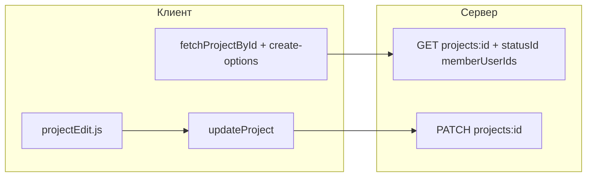

# Форма редактирования проекта

## Контекст

- Роут уже есть: [`client/js/app.js`](client/js/app.js) ветка `project/:id/edit` вызывает заглушку [`renderProjectFormStub`](client/js/pages/projectFormStub.js).
- Форма создания — [`client/js/pages/projectNew.js`](client/js/pages/projectNew.js): поля `name`, `goal`, `statusId`, `startDate`, `endDate`, чекбоксы `participantIds` + `fetchProjectCreateOptions` / `createProject`.
- На сервере в [`server/src/routes/projects.js`](server/src/routes/projects.js) есть только `GET` и `POST`; **обновления нет** — без нового эндпоинта сохранить изменения нельзя.
- `GET /api/projects/:id` отдаёт `project` с `statusName`, но **без** `statusId` и без состава участников — для префилла и чекбоксов это нужно дополнить.
- Кнопка «Редактировать» в [`client/js/pages/projectDetail.js`](client/js/pages/projectDetail.js) сейчас показывается всем, кроме «Клиент» (`roleName !== 'Клиент'`). Создание проекта разрешено только **Админ** и **Менеджер** — для согласованности кнопку редактирования и маршрут `…/edit` нужно ограничить так же.

## Сервер

1. **Расширить** ответ `GET /api/projects/:id` в [`server/src/routes/projects.js`](server/src/routes/projects.js):
   - В SELECT для проекта добавить `p.status_id AS status_id`.
   - В объект `project` добавить поля: `statusId` (число), `memberUserIds` — массив `user_id` из `user_project` для данного `project_id`, где `excluded_at IS NULL` (для префилла чекбоксов: `checked = memberUserIds.includes(u.id)` для строк из `assignableUsers`).

2. **Добавить** `PATCH /api/projects/:id`:
   - **Права:** как у `POST /api/projects`: только **Админ** и **Менеджер**; иначе `403`.
   - **Видимость проекта:** та же, что у `GET /api/projects/:id` (админ/менеджер — любой проект в БД; иначе — только при активном членстве). Если недоступен — `404` с тем же текстом, что и сейчас.
   - **Тело:** те же поля, что и при создании: `name`, `goal`, `startDate`, `endDate`, `statusId`, `participantIds` (массив), с той же валидацией, что в существующем `POST` (даты `YYYY-MM-DD`, `INIT_DATE`, проверка статуса, проверка участников по активному статусу и `ASSIGNABLE_ROLE_NAMES` в зависимости от роли редактора).
   - **Транзакция:**
     - `UPDATE projects SET …` по `id`.
     - **Синхронизация `user_project`:** итоговое множество участников = `{ req.userId } ∪ validated(participantIds)` **плюс** сохранение участников, которые **не попадают** в список assignable для данного редактора (их нет в UI чекбоксов, как у «лишних» ролей после создания), чтобы не снять их по ошибке. Для снятых из состава (есть в текущих активных, не входят в итоговое множество и могут управляться через форму): `UPDATE … SET excluded_at = NOW()`. Для добавленных: `INSERT` или, если исторически была строка с `excluded_at`, снять исключение (`excluded_at = NULL`, при необходимости обновить `included_at`). Не допускать снятие `req.userId` с проекта.
   - **Ответ `200`:** как у `POST 201`: `{ project: { id, name, goal, startDate, endDate, statusName } }`.

3. Обновить документацию в [`.cursor/rules/backend-api.mdc`](.cursor/rules/backend-api.mdc): новые поля `GET /api/projects/:id`, описание `PATCH /api/projects/:id`.

## Клиент: API

- В [`client/js/api/projects.js`](client/js/api/projects.js) добавить `updateProject(id, payload)` — `PATCH /api/projects/:encodedId` с JSON и Bearer.

## Клиент: страница редактирования

1. Новый файл, например [`client/js/pages/projectEdit.js`](client/js/pages/projectEdit.js), экспорт `renderProjectEditPage(container, projectId)`:
   - **Разметка и поведение** как в [`projectNew.js`](client/js/pages/projectNew.js): те же классы (`project-new-page`, `register-card`, поля, `syncDateInputs`, валидация, подсветка `.field--error`, разбор ошибок API через тот же подход, что `fieldsForApiError`).
   - Заголовок, например «Редактирование проекта»; «Назад» — на `#/project/:id` (как в заглушке).
   - Загрузка: `Promise.all([fetchProjectById(projectId), fetchProjectCreateOptions()])`. Ошибка по `create-options` (403 и т.д.) — дружелюбное сообщение; при успехе — префилл:
     - `name`, `goal`, даты: привести значения дат к `YYYY-MM-DD` для `input type="date"` (если приходят ISO-строки с временем — `slice(0, 10)`).
     - `statusId` из `project.statusId`.
     - Чекбоксы: отмечены пользователи из `assignableUsers`, чей `id` есть в `project.memberUserIds`.
   - Кнопка отправки: **иконка** [`client/icons/save-24.svg`](client/icons/save-24.svg) + текст «Сохранить» (например, `button.button.primary` с `img` и `span`, не только иконка — для доступности оставьте видимый текст или явный `aria-label`).
   - Успех: переход на `#/project/:id` (карточка проекта).

2. **Дублирование кода с `projectNew.js`:** вынести общие куски в небольшой модуль, например [`client/js/pages/projectFormShared.js`](client/js/pages/projectFormShared.js) (`el`, `INIT_DATE`, `syncDateInputs`, `clearFieldErrors` / `setFieldErrors`, `attachClearError`, `fieldsForApiError`) и подключить его из `projectNew.js` и `projectEdit.js`, чтобы не копировать ~100 строк. Если нужно минимизировать объём рефакторинга — можно оставить один импорт только из `projectEdit`, а `projectNew` перевести на shared постепенно; предпочтительно обновить оба файла сразу.

3. [`client/js/app.js`](client/js/app.js): для `segs[2] === 'edit'` вызывать `renderProjectEditPage` вместо заглушки; **перед рендером** проверять роль: только `Админ` / `Менеджер`, иначе `history.replaceState` на `#/home` и `renderHomePage` — по аналогии с веткой `projects/new`.

4. [`client/js/pages/projectDetail.js`](client/js/pages/projectDetail.js): показывать кнопку редактирования только если `roleName === 'Админ' || roleName === 'Менеджер'` (вместо «все кроме Клиента»).

5. [`client/js/pages/projectFormStub.js`](client/js/pages/projectFormStub.js): удалить вариант `edit` из `COPY`, если он больше не используется (косметика).

6. Обновить [`.cursor/rules/frontend-architecture.mdc`](.cursor/rules/frontend-architecture.mdc): строка про заглушку `#/project/:id/edit` → реальная страница и `updateProject`.

## Проверка вручную

- Под пользователем Менеджер/Админ: открыть проект → «Редактировать» → изменить поля и участников → «Сохранить» → данные на карточке обновились.
- Клиент: кнопки редактирования нет; прямой `#/project/1/edit` — редирект на `#/home`.
- Ошибки валидации и от API отображаются как на форме создания.
