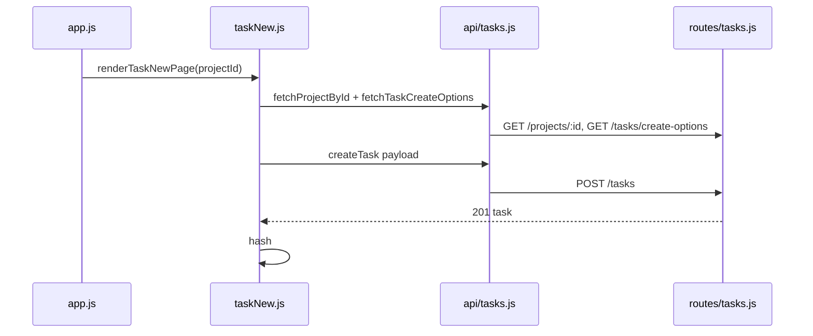

# Форма создания технического задания

## Контекст

- Сейчас [`client/js/app.js`](client/js/app.js) для `#/project/:id/tasks/new` вызывает [`renderProjectFormStub`](client/js/pages/projectFormStub.js).
- Бэкенд [`server/src/routes/tasks.js`](server/src/routes/tasks.js) содержит только **GET** `/api/tasks` — **POST** нет.
- Таблица `tasks` ([`server/db_init/init.js`](server/db_init/init.js)): `name`, `description`, `deadline` (TIMESTAMPTZ), `role_id` → `roles`, `project_id`, `status_id` → `statuses_tasks`.
- Сейчас «Добавить ТЗ» в [`projectDetail.js`](client/js/pages/projectDetail.js) видно всем, кроме **Клиент** — после изменения правок: показывать **только Админ и Менеджер** (как кнопка редактирования проекта). Список ТЗ (`GET /api/tasks`) для **Клиент** и **Внешний подрядчик** по-прежнему запрещён; **Исполнитель** может смотреть ТЗ, но **не создаёт** их.

## Права доступа

| Роль | POST создание ТЗ, GET create-options |
|------|----------------------------------------|
| Админ, Менеджер | Да, если проект существует и доступен по тем же правилам, что `GET /api/projects/:id` (паттерн `seeAll` + `user_project` в [`projects.js`](server/src/routes/projects.js)). |
| Исполнитель | **403** (и редирект с формы на клиенте, например на `#/home` как у `#/projects/new`). |
| Клиент | **403**; на клиенте — тот же guard маршрута, что у `projects/new` / `project/:id/edit` (**редирект на `#/home`** при прямом вводе URL). |
| Внешний подрядчик | **403** (как у `GET /api/tasks`). |

## Бэкенд

**Файл:** [`server/src/routes/tasks.js`](server/src/routes/tasks.js)

1. **`GET /api/tasks/create-options`** (`requireAuth`):
   - Доступ **только Админ и Менеджер**; иначе **403** (включая **Исполнитель**, **Клиент**, **Внешний подрядчик**) — аналогично `GET /api/projects/create-options`.
   - **200:** `{ statuses: [{ id, name }], taskRoles: [{ id, name }] }` — статусы из `statuses_tasks`; **taskRoles** — это допустимые **типы исполнения ТЗ** в БД: роли **«Исполнитель»** и **«Внешний подрядчик»** из `roles` (`WHERE name IN (...)`), порядок фиксированный.

2. **`POST /api/tasks`** (`requireAuth`):
   - Снова **только Админ и Менеджер**; иначе **403**.
   - **Body (JSON):** `projectId`, `name`, `description` (строка; допускать `''` — поле NOT NULL в БД), `deadline` (**YYYY-MM-DD**), `roleId`, `statusId`.
   - Загрузить проект: `start_date`, `end_date`; если нет или нет доступа — **404** «Проект не найден.» (как у деталей проекта).
   - Проверки:
     - `name` после trim непустой;
     - `deadline` формат `DATE_RE`;
     - **дедлайн по календарной дате:** `deadline` ∈ `[start_date, end_date]` включительно (сравнение дат как у проекта);
     - `statusId` ∈ `statuses_tasks`;
     - `roleId` ∈ множестве id ролей «Исполнитель» и «Внешний подрядчик» (не любая роль из `roles`).
   - **INSERT:** в `deadline` записать однозначный момент времени, например `(date)::timestamp AT TIME ZONE 'UTC'` или полночь UTC от даты — главное, чтобы сравнение «внутри проекта» на сервере оставалось по дате; на клиенте уже используется `formatDateTimeRu` для отображения.
   - **201:** `{ task: { id, projectId, name, description, deadline, roleId?, roleName, statusId, statusName } }` (минимально достаточно для редиректа и консистентности).

Регистрация маршрутов: путь **`/tasks/create-options`** объявить отдельным `router.get`, чтобы не пересёкся с возможными будущими `/:id` (сейчас конфликта нет).

## Клиент

**Новый файл:** `client/js/pages/taskNew.js` (или `projectTaskNew.js` — один экран = один файл в [`client/js/pages/`](client/js/pages/))

- Импорт хелперов из [`projectFormShared.js`](client/js/pages/projectFormShared.js): `el`, `DATE_RE`, `attachClearError`, `clearFieldErrors`, `setFieldErrors`, `toDateInputValue`, при необходимости лёгкая функция маппинга текста ошибки API → поля (по аналогии с `fieldsForApiError`).
- Разметка как у [`projectNew.js`](client/js/pages/projectNew.js): `main.page.register-page.project-new-page`, `register-card`, заголовок «Новое техническое задание», кнопка «Назад» → `#/project/:id`.
- **Перед построением формы:** параллельно `fetchProjectById(projectId)` и новый **`fetchTaskCreateOptions()`** из API-модуля задач.
  - Если проект не загрузился — сообщение и ссылка «К проекту» / «К проектам» (как на других экранах).
  - Если роль не **Админ** и не **Менеджер** — форму не показывать (основной guard — в [`app.js`](client/js/app.js) на маршрут `tasks/new`, редирект на `#/home`); при необходимости дублирующая проверка в странице.
- Поля:
  - Название (text, required);
  - Описание (textarea; можно разрешить пустое, если бэкенд принимает `''`);
  - Дедлайн (`input type="date`): **`min` / `max`** из `toDateInputValue(project.startDate)` / `toDateInputValue(project.endDate)`; дополнительная проверка на submit;
  - Роль ТЗ — `select` из `taskRoles` (два варианта);
  - Статус — `select` из `statuses` (дефолт, например «К выполнению», если есть).
- Submit → **`createTask`** → успех: `location.hash = \`#/project/${projectId}\``.

**Файл:** [`client/js/api/tasks.js`](client/js/api/tasks.js)

- `fetchTaskCreateOptions()` — GET `/api/tasks/create-options`, Bearer.
- `createTask(body)` — POST `/api/tasks`, JSON, Bearer, `parseJsonSafe`, русские ошибки.

**Файл:** [`client/js/app.js`](client/js/app.js)

- Импорт `renderTaskNewPage` вместо заглушки для ветки `tasks/new`.
- Ограничение маршрута: **только Админ и Менеджер** (как `#/project/:id/edit` и `#/projects/new`); иначе редирект на `#/home`.
- Вариант: оставить `projectFormStub` для `collections-new` / `media-new`.

**Файл:** [`client/js/pages/projectDetail.js`](client/js/pages/projectDetail.js)

- Текстовая ссылка **«Добавить ТЗ»** и карточка **«Добавить ТЗ»** в пустой сетке — **только Админ и Менеджер**. Заголовок секции и переход на **`#/tasks?projectId=`** (список ТЗ) оставить для **Исполнителя** как сейчас для не-клиентов (у **Клиента** по-прежнему без ссылок на ТЗ).

Стили: по возможности только существующие классы из [`client/styles/main.css`](client/styles/main.css) (`.field`, `.field--error`, `.register-form`, и т.д.); новые правила — только при необходимости.

## Документация API

При принятом у вас процессе — дополнить [`.cursor/rules/backend-api.mdc`](.cursor/rules/backend-api.mdc) описанием `GET /tasks/create-options` и `POST /tasks` (если правило — источник правды для команды).

## Поток данных (кратко)

