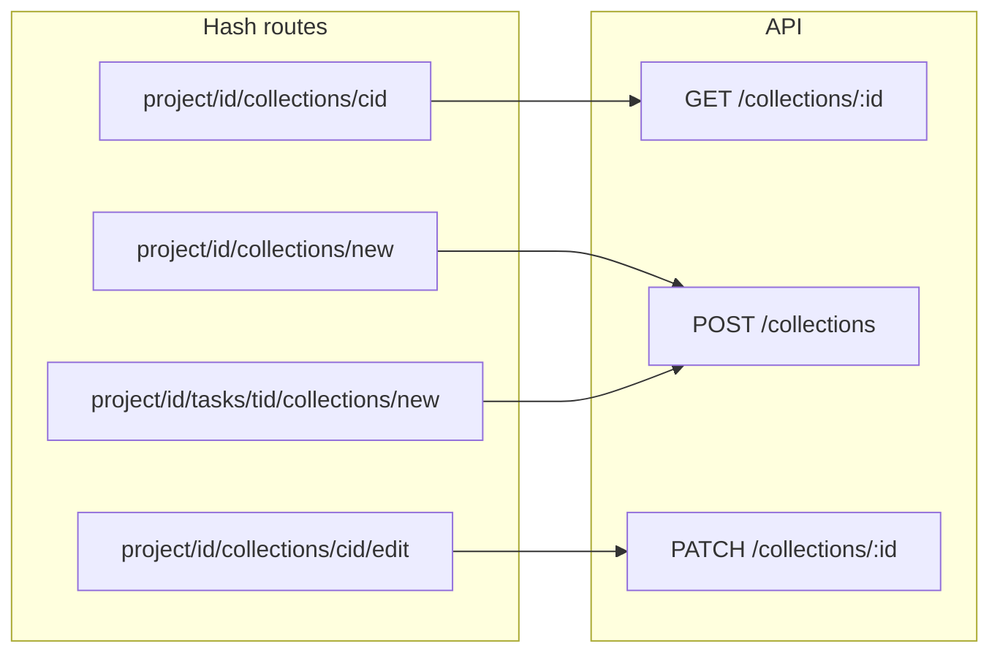

# Формы просмотра, создания и редактирования коллекции

## Контекст

- Сейчас доступен только [`GET /api/collections`](c:\Users\eQurane\VSCode\mox\server\src\routes\collections.js) (список с фильтрами). Эндпоинтов для одной коллекции нет.
- Создание коллекции на клиенте — заглушка [`projectFormStub.js`](c:\Users\eQurane\VSCode\mox\client\js\pages\projectFormStub.js) по маршруту `#/project/:id/collections/new` в [`app.js`](c:\Users\eQurane\VSCode\mox\client\js\app.js).
- Карточки коллекций в [`projectDetail.js`](c:\Users\eQurane\VSCode\mox\client\js\pages\projectDetail.js), [`taskDetail.js`](c:\Users\eQurane\VSCode\mox\client\js\pages\taskDetail.js) и [`collectionsList.js`](c:\Users\eQurane\VSCode\mox\client\js\pages\collectionsList.js) не ведут на отдельный экран.
- **Загрузка файлов:** в репозитории нет `POST /api/media` / `multer`; медиа только читаются. Реализацию самой загрузки в этот объём не включать: на экране коллекции — та же **карточка «Добавить медиа»**, что на проекте/ТЗ, со **ссылкой** `#/project/:projectId/media/new?collectionId=:id` (диплинк для будущей формы). При желании позже доработать [`projectFormStub`](c:\Users\eQurane\VSCode\mox\client\js\pages\projectFormStub.js) / форму медиа, читая `collectionId` из hash query.

## Бэкенд: [`server/src/routes/collections.js`](c:\Users\eQurane\VSCode\mox\server\src\routes\collections.js)

Вынести общие константы/хелперы (роли `Админ`/`Менеджер`, `fetchRoleNameByUserId`, условие «проект в зоне видимости») по тому же принципу, что в [`tasks.js`](c:\Users\eQurane\VSCode\mox\server\src\routes\tasks.js): для **чтения** одной коллекции использовать видимость **как у `GET /api/tasks/:id`** (Внешний подрядчик — `403`; Клиент и Исполнитель — при активном `user_project`; Админ/Менеджер — всё). Так клиент сможет открыть коллекцию с карточки проекта, хотя список `#/collections` для клиента по-прежнему закрыт на фронте.

1. **`GET /api/collections/:id`**  
   - Валидация `id`.  
   - JOIN `collections` → `tasks` → `projects`, условие видимости по `tasks.project_id`.  
   - Ответ: `{ collection: { id, taskId, projectId, projectName, taskName, name, description, createdAt, lastEditedAt }, media: [...] }`.  
   - Медиа: тот же набор полей, что в [`GET /api/tasks/:id`](c:\Users\eQurane\VSCode\mox\server\src\routes\tasks.js) / вложения проекта (`id`, `collectionId`, `path`, `name`, `format`, `description`, `uploadAt`, `statusName`), только `WHERE m.collection_id = :id`, сортировка по `upload_at DESC`.  
   - `404` с текстом вроде «Коллекция не найдена.» при отсутствии или недоступности.

2. **`POST /api/collections`**  
   - Доступ только **Админ** и **Менеджер** (как `POST /api/tasks`).  
   - Body: `taskId` (integer), `name` (trim, непустой), `description` (строка, допускается пустая).  
   - Проверка: задача существует; проект задачи «видим» редактору через ту же логику, что при записи в ТЗ (см. `fetchProjectDatesIfVisible` / проверку в `tasks.js`).  
   - `INSERT`: `created_at` и `last_edited_at` = `NOW()` (удовлетворяет CHECK в [`init.js`](c:\Users\eQurane\VSCode\mox\server\db_init\init.js)).  
   - `201`: `{ collection: { id, taskId, projectId, name, description, createdAt, lastEditedAt, … } }` (как удобно для клиента).

3. **`PATCH /api/collections/:id`**  
   - Только **Админ** и **Менеджер**.  
   - Body: `name`, `description` (те же правила).  
   - Коллекция должна существовать и её `tasks.project_id` должен быть доступен редактору (как при PATCH задачи).  
   - `UPDATE` + `last_edited_at = NOW()`.  
   - `200`: актуальный объект коллекции.

Зарегистрировать маршруты **до** или **после** `/collections` без конфликта: в Express путь `/collections/:id` не пересечётся с `GET /collections`, если `:id` числовой; при необходимости порядок `router.get('/collections/:id')` после общего `get('/collections')` ок.

## Клиент: API [`client/js/api/collections.js`](c:\Users\eQurane\VSCode\mox\client\js\api\collections.js)

- `fetchCollectionById(id)`  
- `createCollection({ taskId, name, description })`  
- `updateCollection(id, { name, description })`  

Паттерн ошибок и `Bearer` — как в [`tasks.js`](c:\Users\eQurane\VSCode\mox\client\js\api\tasks.js) / [`projects.js`](c:\Users\eQurane\VSCode\mox\client\js\api\projects.js).

## Клиент: маршруты [`client/js/app.js`](c:\Users\eQurane\VSCode\mox\client\js\app.js)

Ветка `project/:id` (числовой id), аналогично ТЗ:

| Путь | Действие |
|------|----------|
| `project/:id/collections/new` | `renderCollectionNewPage(appRoot, id)` — только Админ/Менеджер |
| `project/:id/tasks/:taskId/collections/new` | `renderCollectionNewPage(appRoot, id, taskId)` — только Админ/Менеджер; **диплинк с экрана ТЗ** |
| `project/:id/collections/:collectionId` | `renderCollectionDetailPage` — роли как у просмотра проекта/ТЗ (не редирект Клиента с проекта) |
| `project/:id/collections/:collectionId/edit` | `renderCollectionEditPage` — только Админ/Менеджер |

Расширить `isProtectedRoute` для сегментов `…/collections/…`.

Убрать вызов `renderProjectFormStub(…, 'collections-new')`, заменить на реальную страницу.

## Клиент: новые страницы (`client/js/pages/`)

Стиль — как [`taskNew.js`](c:\Users\eQurane\VSCode\mox\client\js\pages\taskNew.js) / [`taskEdit.js`](c:\Users\eQurane\VSCode\mox\client\js\pages\taskEdit.js) / [`taskDetail.js`](c:\Users\eQurane\VSCode\mox\client\js\pages\taskDetail.js): `main.page` / `dashboard project-detail`, шапка с «назад», хелпер `el` из [`projectFormShared.js`](c:\Users\eQurane\VSCode\mox\client\js\pages\projectFormShared.js).

1. **`collectionNew.js`**  
   - Без `taskId` в URL: загрузить `fetchProjectById`, `fetchTasks({ projectId })`; форма — выбор ТЗ (`select`), название, описание; отправка `createCollection`; успех → `#/project/:projectId/collections/:newId` (или на проект — лучше на карточку коллекции).  
   - С `taskId`: загрузить `fetchTaskById`; проверить `task.projectId === projectId`; иначе сообщение + ссылка «в правильный проект» (как в taskDetail); поле ТЗ не редактируется (подпись с именем ТЗ).

2. **`collectionDetail.js`**  
   - `fetchCollectionById(collectionId)`; сравнить `collection.projectId` с `projectId` из URL; при несовпадении — блок ошибки + ссылка на корректный hash.  
   - Блок полей: название, описание, даты (формат как на других страницах), ссылки на **`#/project/:projectId`** и **`#/project/:projectId/tasks/:taskId`**.  
   - Сетка медиа — переиспользовать логику превью как в `taskDetail` / `projectDetail`.  
   - Кнопка редактирования — только Админ/Менеджер → edit route.  
   - Карточка «Добавить медиа`: `buildSectionCreateCard` → `#/project/:projectId/media/new?collectionId=:collectionId`.

3. **`collectionEdit.js`**  
   - Параллельно `fetchCollectionById` + при необходимости контекст проекта; форма name/description; `updateCollection`; успех → detail.

**Мелочь:** общий хелпер разметки полей можно вынести в небольшой `collectionFormShared.js` только если код дублируется заметно; иначе держать в new/edit без лишних файлов.

## Интеграция существующих экранов

- [`taskDetail.js`](c:\Users\eQurane\VSCode\mox\client\js\pages\taskDetail.js): `hrefCollectionsNew` заменить на `#/project/${projectId}/tasks/${taskId}/collections/new`; карточки коллекций сделать ссылкой на `#/project/${projectId}/collections/${c.id}` (класс как у карточки ТЗ с `project-card--link`).  
- [`projectDetail.js`](c:\Users\eQurane\VSCode\mox\client\js\pages\projectDetail.js): то же для карточек коллекций (ссылка на detail с известным `projectId` и `col.taskId` в URL).  
- [`collectionsList.js`](c:\Users\eQurane\VSCode\mox\client\js\pages\collectionsList.js): заголовок карточки или вся карточка — ссылка на `#/project/:projectId/collections/:id`.

## Документация (синхронизация)

- [`c:\Users\eQurane\VSCode\mox\.cursor\rules\backend-api.mdc`](c:\Users\eQurane\VSCode\mox\.cursor\rules\backend-api.mdc): в таблицу эндпоинтов и отдельные секции описать `GET/POST/PATCH /api/collections…`, тела, коды, видимость.  
- [`c:\Users\eQurane\VSCode\mox\.cursor\rules\backend-architecture.mdc`](c:\Users\eQurane\VSCode\mox\.cursor\rules\backend-architecture.mdc): перечислить новые защищённые маршруты API.  
- [`c:\Users\eQurane\VSCode\mox\.cursor\rules\frontend-architecture.mdc`](c:\Users\eQurane\VSCode\mox\.cursor\rules\frontend-architecture.mdc): описать hash-маршруты коллекций и новые файлы в `js/pages/`, обновить упоминание заглушки коллекции.  
- [`c:\Users\eQurane\VSCode\mox\.cursor\rules\project-structure.mdc`](c:\Users\eQurane\VSCode\mox\.cursor\rules\project-structure.mdc): дополнить `routes/collections.js` и клиентские модули.

## Поток данных (кратко)

## Риски / ограничения

- Реальной загрузки файлов нет — только UI-карточка и query `collectionId` для будущей формы медиа.  
- При добавлении `POST /api/media` позже — опираться на тот же `projectId` и проверку членства по цепочке коллекция → задача → проект.
