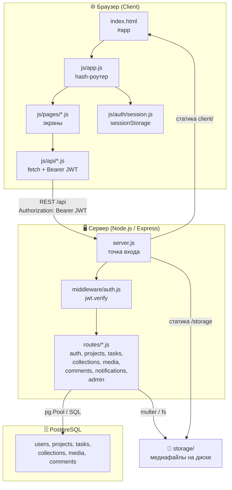
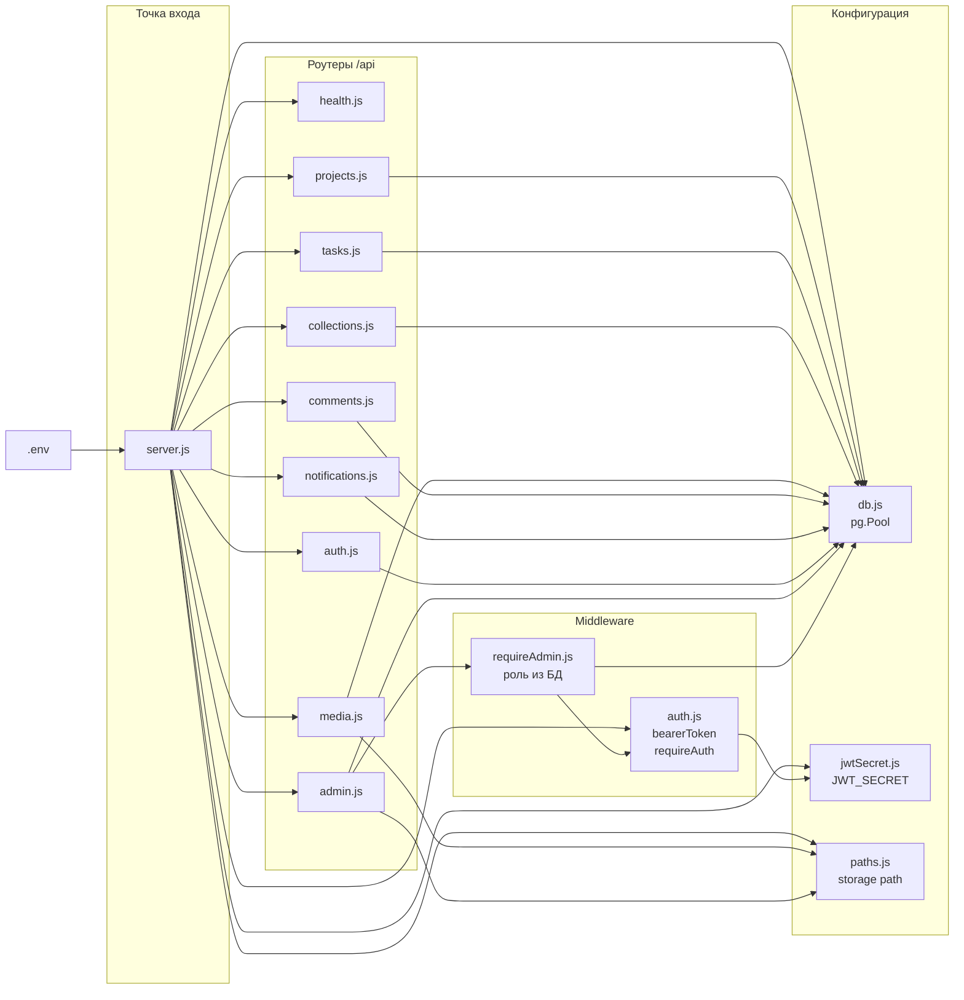
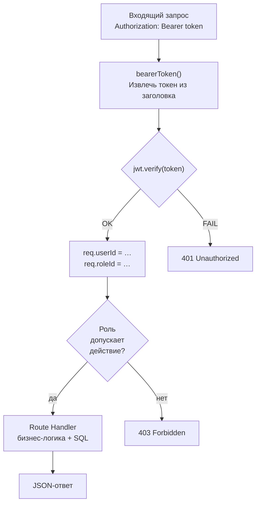
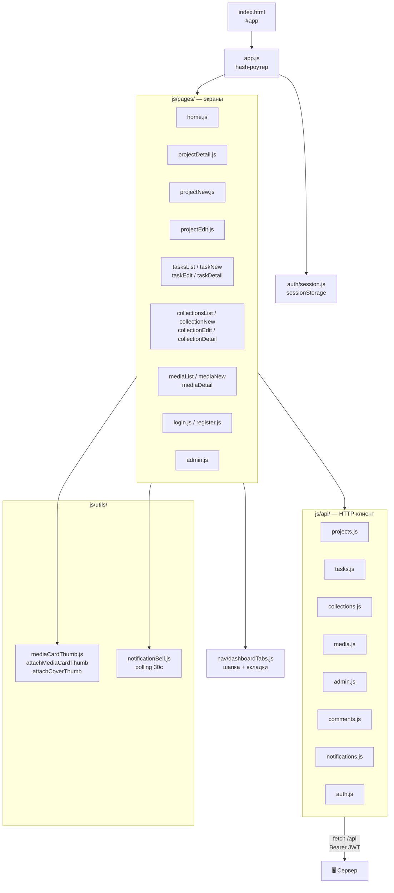
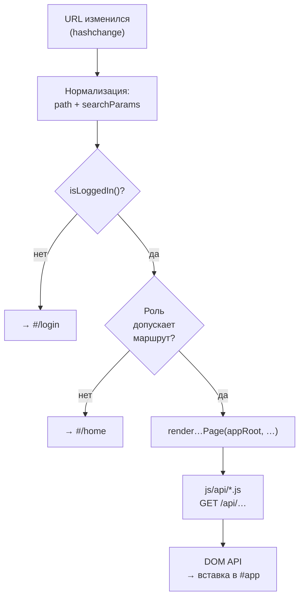
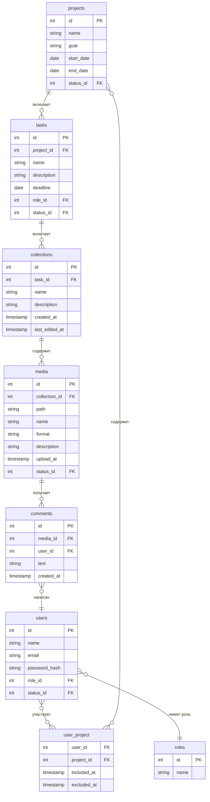
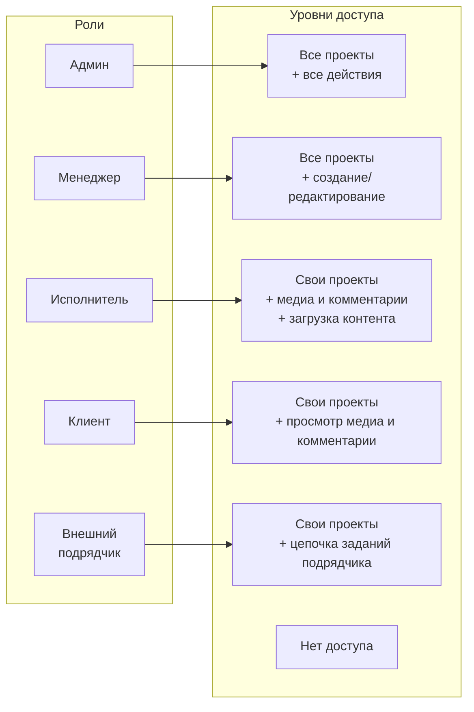
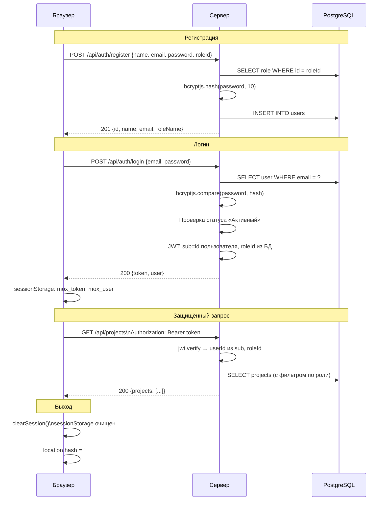

# Отчёт по проекту Mox

## Содержание

1. [Общее описание](#1-общее-описание)
2. [Клиент-серверная архитектура](#2-клиент-серверная-архитектура)
3. [Серверная часть](#3-серверная-часть)
4. [Клиентская часть](#4-клиентская-часть)
5. [Доменная модель и иерархия сущностей](#5-доменная-модель-и-иерархия-сущностей)
6. [Роли и права доступа](#6-роли-и-права-доступа)
7. [REST API](#7-rest-api)
8. [Поток аутентификации](#8-поток-аутентификации)

См. также [диаграмма потока экрана «Проекты»](diagramm.md).

---

## 1. Общее описание

**Mox** — веб-платформа для управления проектами с медиаконтентом. Система позволяет организовывать работу над проектами: создавать задания, группировать медиафайлы в коллекции, оставлять комментарии и получать уведомления об активности.

**Ключевые возможности:**

- Управление проектами, заданиями и коллекциями
- Загрузка, замена и архивирование медиафайлов (изображения, видео, аудио, документы)
- Комментирование медиа участниками проекта
- Ролевая модель доступа с гибкими ограничениями по видимости
- Уведомления о новых комментариях (polling каждые 30 с)
- Админ-панель: пользователи и статусы, обзор и «проблемы» данных, большие файлы в `storage/`, безвозвратное удаление медиа

**Технологический стек:**

| Слой | Технологии |
|---|---|
| Фронтенд | HTML + CSS + ванильный JavaScript (ES Modules), без фреймворков |
| Бэкенд | Node.js, Express.js |
| База данных | PostgreSQL (`pg`, connection pool) |
| Аутентификация | JWT (`jsonwebtoken`), хэширование паролей `bcryptjs` |
| Хранение файлов | Файловая система (`storage/` в корне репозитория) |
| Разработка | `nodemon`, `dotenv`, `cors` |

---

## 2. Клиент-серверная архитектура



**Принципы взаимодействия:**

- Весь обмен данными — через REST API с префиксом `/api`, формат JSON
- Исключение: загрузка файлов — `multipart/form-data` (`POST /api/media`, `POST /api/media/:id/replace`)
- JWT-токен выдаётся при логине и хранится в `sessionStorage` на стороне клиента
- Каждый защищённый запрос передаёт токен в заголовке `Authorization: Bearer <token>`
- Медиафайлы после загрузки на сервер раздаются как статика по пути `/storage/<filename>`

---

## 3. Серверная часть

### Структура файлов

```
server/
├── src/
│   ├── server.js             ← точка входа: Express-приложение
│   │                           раздаёт client/ как статику,
│   │                           storage/ по пути /storage,
│   │                           монтирует роутеры на /api
│   ├── db.js                 ← пул подключений PostgreSQL (pg.Pool)
│   ├── paths.js              ← абсолютный путь к storage/
│   ├── jwtSecret.js          ← JWT_SECRET и JWT_EXPIRES_IN из env
│   ├── access/
│   │   └── contractorTaskScope.js  ← фильтрация цепочек заданий для «Внешнего подрядчика»
│   ├── middleware/
│   │   ├── auth.js           ← bearerToken + requireAuth (JWT → req.userId, req.roleId)
│   │   └── requireAdmin.js   ← после requireAuth: только роль «Админ»
│   └── routes/
│       ├── health.js         ← GET /api/health, /api/health/db
│       ├── auth.js           ← register, login, /auth/me
│       ├── projects.js       ← CRUD проектов + create-options
│       ├── tasks.js          ← CRUD заданий + create-options
│       ├── collections.js    ← CRUD коллекций
│       ├── media.js          ← загрузка, замена, soft-delete
│       ├── comments.js       ← комментарии к медиа
│       ├── notifications.js   ← уведомления (derived query)
│       └── admin.js         ← пользователи, обзор, проблемы, большие файлы, жёсткое удаление медиа
└── db_init/
    └── init.js               ← создание БД, схемы, seed справочников
```

### Схема модулей сервера



На маршрутах **`/api/admin/…`** для каждого обработчика задаётся цепочка **`requireAuth` → `requireAdmin`** в **`admin.js`** (роль «Админ» проверяется по БД в **`requireAdmin`**).

### Переменные окружения (`server/.env`)

| Переменная | Назначение |
|---|---|
| `PORT` | Порт сервера (по умолчанию `3000`) |
| `NODE_ENV` | В `production` без `JWT_SECRET` процесс завершается при старте (`jwtSecret.js`) |
| `DATABASE_HOST` / `_PORT` / `_NAME` / `_USER` / `_PASSWORD` | Параметры PostgreSQL (имя БД по умолчанию в коде инициализации — `mox`) |
| `JWT_SECRET` | Секрет подписи JWT (обязателен в production) |
| `JWT_EXPIRES_IN` | Срок жизни токена (по умолчанию `7d`) |
| `REGISTER_USER_STATUS` | **Обязательна:** точное имя строки из `statuses_users` для `POST /api/auth/register` (см. `server/.env.example`: модерация — «На подтверждении», локальный dev без очереди — «Активный») |
| `INIT_DATE` | Нижняя граница дат в CHECK схемы и при валидации проектов/заданий (по умолчанию в `db_init` — `2026-05-01`) |

### Поток авторизации запроса



---

## 4. Клиентская часть

### Структура файлов

```
client/
├── index.html                ← оболочка SPA: <div id="app">
├── styles/main.css           ← все стили приложения
├── icons/                    ← SVG-иконки (back, save, edit, list,
│                               no-image, notifications, video, music,
│                               table, docs)
└── js/
    ├── app.js                ← bootstrap + hash-роутер
    ├── auth/
    │   └── session.js        ← getToken, setSession, clearSession,
    │                           isLoggedIn, getUserSnapshot
    │                           (хранилище: sessionStorage)
    ├── api/
    │   ├── auth.js           ← login, register, fetchMe
    │   ├── projects.js       ← fetchProjects, fetchProjectById,
    │   │                       createProject, updateProject, …
    │   ├── tasks.js          ← fetchTasks, fetchTaskById,
    │   │                       createTask, updateTask, …
    │   ├── collections.js    ← fetchCollections, fetchCollectionById, …
    │   ├── media.js          ← fetchMedia, uploadMedia, replaceMedia,
    │   │                       updateMedia, deleteMedia, …
    │   ├── admin.js          ← пользователи, approve, overview, большие файлы, hard-delete медиа
    │   ├── comments.js       ← fetchComments, addComment
    │   └── notifications.js  ← fetchNotifications
    ├── utils/
    │   ├── mediaCardThumb.js ← attachMediaCardThumb, attachCoverThumb
    │   └── notificationBell.js ← renderNotificationBell (polling 30с)
    ├── nav/
    │   └── dashboardTabs.js  ← шапка с вкладками
    └── pages/
        ├── login.js / register.js
        ├── home.js / admin.js
        ├── projectNew.js / projectEdit.js / projectDetail.js
        ├── tasksList.js / taskNew.js / taskEdit.js / taskDetail.js
        ├── collectionsList.js / collectionNew.js
        │   collectionEdit.js / collectionDetail.js
        ├── mediaList.js / mediaNew.js / mediaDetail.js
        └── projectFormStub.js / projectFormShared.js / taskFormShared.js
```

### Схема модулей клиента



### Роутинг и защита маршрутов



---

## 5. Доменная модель и иерархия сущностей



**Обложки (`coverPath`)** вычисляются динамически — последний загруженный медиафайл по цепочке вниз (`upload_at DESC`). Отдельного поля в БД нет.

---

## 6. Роли и права доступа



**Матрица прав:**

| Действие | Админ | Менеджер | Исполнитель | Клиент | Внеш. |
|---|:---:|:---:|:---:|:---:|:---:|
| Просмотр всех проектов | ✓ | ✓ | — | — | — |
| Просмотр своих проектов (членство `user_project`, у подрядчика контент ограничен типом задания) | ✓ | ✓ | ✓ | ✓ | ✓ |
| Создание / редактирование проекта | ✓ | ✓ | — | — | — |
| Просмотр задание / коллекций (глобальные списки и API списков) | ✓ | ✓ | ✓ | — | — |
| Просмотр медиа и карточки медиа (при членстве в проекте) | ✓ | ✓ | ✓ | ✓ | ✓ |
| Создание задания | ✓ | ✓ | — | — | — |
| Создание коллекции (`POST /api/collections`, член проекта; подрядчик — только задания типа подрядчик) | ✓ | ✓ | ✓ | — | ✓ |
| Загрузка медиа (`POST /api/media`) | ✓ | ✓ | ✓ | — | — |
| Редактирование описания медиа | ✓ | ✓ | ✓ | — | — |
| Soft-delete медиа | ✓ | ✓ | ✓ | — | — |
| Замена файла медиа | ✓ | ✓ | — | — | — |
| Комментарии к медиа | ✓ | ✓ | ✓ | ✓ | — |
| Уведомления (колокольчик) | ✓ | ✓ | — | — | — |
| Админ-API (`GET/PATCH/POST/DELETE /api/admin/…`) | ✓ | — | — | — | — |
| Раздел `/admin` | ✓ | — | — | — | — |
| Назначить Менеджера участником | ✓ | — | — | — | — |

---

## 7. REST API

### Сводная таблица эндпоинтов

| Метод | Путь | Описание | Доступ |
|---|---|---|---|
| GET | `/api/health` | Статус сервера | публичный |
| GET | `/api/health/db` | Проверка БД | публичный |
| GET | `/api/auth/register-options` | Список ролей | публичный |
| POST | `/api/auth/register` | Регистрация | публичный |
| POST | `/api/auth/login` | Логин, выдача JWT | публичный |
| GET | `/api/auth/me` | Текущий пользователь | Bearer |
| GET | `/api/projects` | Список проектов | Bearer |
| GET | `/api/projects/create-options` | Справочники для формы | Bearer, Админ/Менеджер |
| POST | `/api/projects` | Создать проект | Bearer, Админ/Менеджер |
| GET | `/api/projects/:id` | Карточка проекта (с задания, коллекциями, медиа) | Bearer |
| PATCH | `/api/projects/:id` | Обновить проект | Bearer, Админ/Менеджер |
| GET | `/api/tasks` | Список задание (с фильтрами) | Bearer |
| GET | `/api/tasks/create-options` | Справочники для формы задания | Bearer, Админ/Менеджер |
| POST | `/api/tasks` | Создать задание | Bearer, Админ/Менеджер |
| GET | `/api/tasks/:id` | Карточка задания | Bearer |
| PATCH | `/api/tasks/:id` | Обновить задание | Bearer, Админ/Менеджер |
| GET | `/api/collections` | Список коллекций (с фильтрами) | Bearer |
| POST | `/api/collections` | Создать коллекцию | Bearer, Админ/Менеджер/Исполнитель/Внешний подрядчик (задания типа подрядчик) |
| GET | `/api/collections/:id` | Карточка коллекции (с медиа) | Bearer |
| PATCH | `/api/collections/:id` | Обновить коллекцию | Bearer, Админ/Менеджер |
| GET | `/api/media` | Список медиа (с фильтрами) | Bearer |
| POST | `/api/media` | Загрузить файл (multipart) | Bearer, Админ/Менеджер/Исполнитель/Внешний подрядчик |
| GET | `/api/media/:id` | Карточка медиа | Bearer |
| PATCH | `/api/media/:id` | Обновить описание | Bearer, Мен/Адм/Исп |
| DELETE | `/api/media/:id` | Soft-delete → статус «Удалённый» | Bearer, Мен/Адм/Исп |
| POST | `/api/media/:id/replace` | Заменить файл (новая запись + архив старой) | Bearer, Админ/Менеджер |
| GET | `/api/media/:id/comments` | Список комментариев | Bearer, не подрядчик; Клиент допускается |
| POST | `/api/media/:id/comments` | Добавить комментарий | Bearer, не подрядчик; Клиент допускается |
| GET | `/api/notifications` | Последние комментарии по проектам | Bearer, Админ/Менеджер |
| GET | `/api/admin/users` | Список пользователей (фильтры `q`, статус, роль, пагинация) | Bearer, только Админ |
| GET | `/api/admin/users/:id` | Карточка пользователя и проекты | Bearer, только Админ |
| PATCH | `/api/admin/users/:id` | Обновление роли и/или статуса | Bearer, только Админ |
| POST | `/api/admin/users/:id/approve` | Перевести «На подтверждении» → «Активный» | Bearer, только Админ |
| DELETE | `/api/admin/users/:id` | Удалить учётную запись (ограничения на сервере) | Bearer, только Админ |
| GET | `/api/admin/overview` | Сводка по БД | Bearer, только Админ |
| GET | `/api/admin/issues` | Проблемные данные (проекты без участников и т.д.) | Bearer, только Админ |
| GET | `/api/admin/storage/large-files` | Файлы в `storage/` больше 50 МБ | Bearer, только Админ |
| DELETE | `/api/admin/media/:id` | Жёсткое удаление медиа и файла на диске | Bearer, только Админ |

---

## 8. Поток аутентификации


