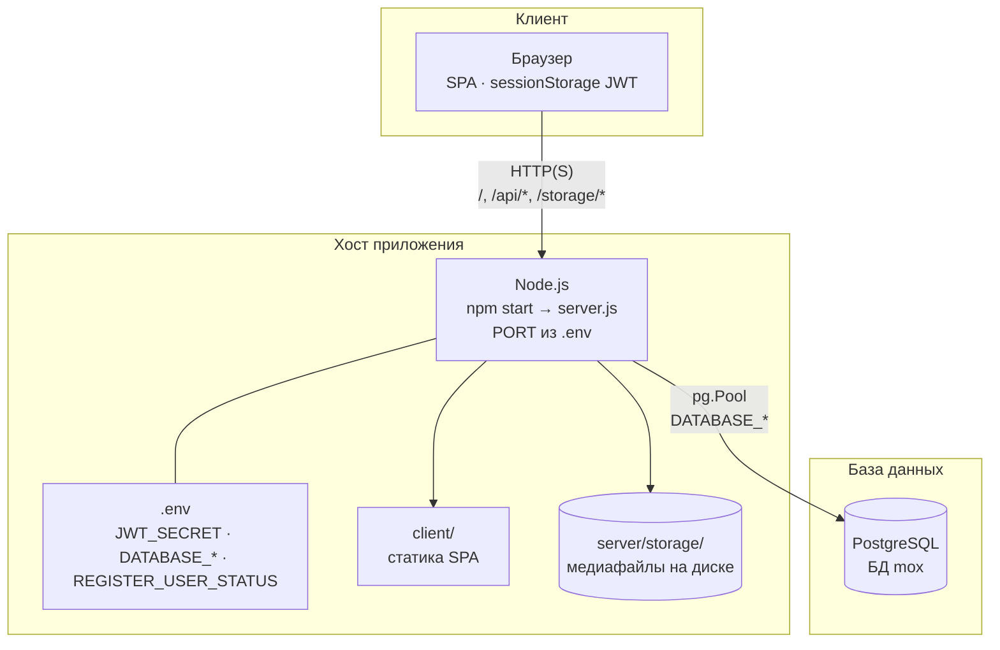
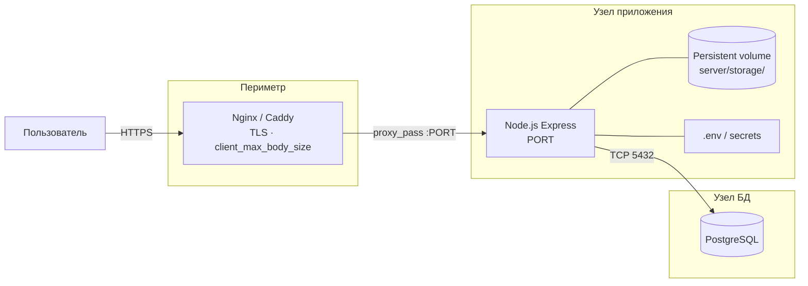
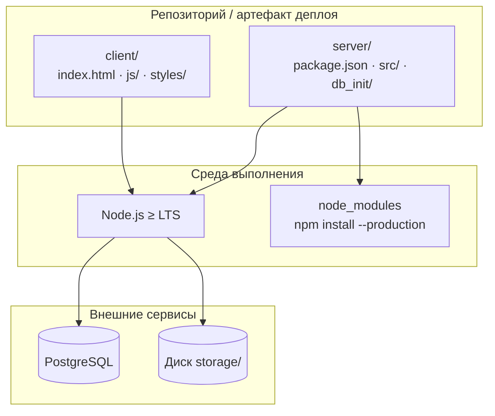
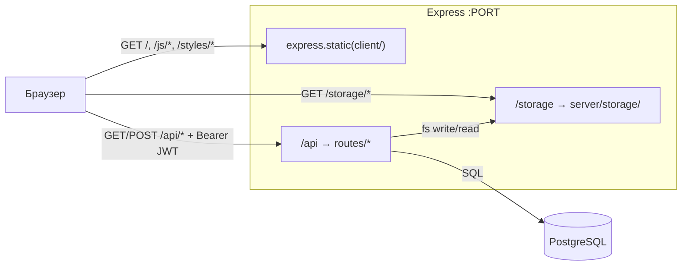

# Диаграмма развёртывания (Mox)

Описывает **физические и логические узлы** при запуске системы. Для потоков запросов см. [diagramm.md](diagramm.md); для модулей внутри процесса — [README.md §2](README.md#2-клиент-серверная-архитектура).

Точка входа: `server/src/server.js` — один процесс Node.js раздаёт SPA (`client/`), REST API (`/api`) и медиа (`/storage` → `server/storage/`).

---

## Базовое развёртывание (один хост)

Подходит для локальной разработки и небольшого production: PostgreSQL на том же или соседнем хосте, без отдельного reverse proxy.

**Инициализация (однократно):** `npm run db:init` в каталоге `server/` — создание БД и схемы (`db_init/init.js`).

**Проверка работоспособности:** `GET /api/health`, `GET /api/health/db`.

---

## Рекомендуемое production-развёртывание

Типовая схема: TLS и лимиты загрузки на reverse proxy, приложение за прокси, PostgreSQL на отдельном узле или managed-сервисе, **постоянный том** для `server/storage/`.

> При **нескольких** экземплярах Node за балансировщиком каталог `storage/` должен быть **общим** (NFS, сетевой том и т.п.) или позже — внешнее object storage. Иначе файл, загруженный на инстанс A, не откроется с инстанса B.

---

## Артефакты и зависимости на узле приложения

| Компонент | Расположение | Назначение |
|-----------|--------------|------------|
| SPA | `client/` | Hash-роутер, страницы, `fetch` к `/api` |
| API | `server/src/routes/` | REST, JWT, multer-загрузки |
| Медиа на диске | `server/storage/` | Файлы; URL в БД: `/storage/<имя>` |
| Метаданные | PostgreSQL | Пользователи, проекты, медиа, комментарии |
| Секреты | `.env` на сервере | `JWT_SECRET` (обязателен при `NODE_ENV=production`), `DATABASE_*`, `REGISTER_USER_STATUS` |

---

## Потоки по границам узлов

