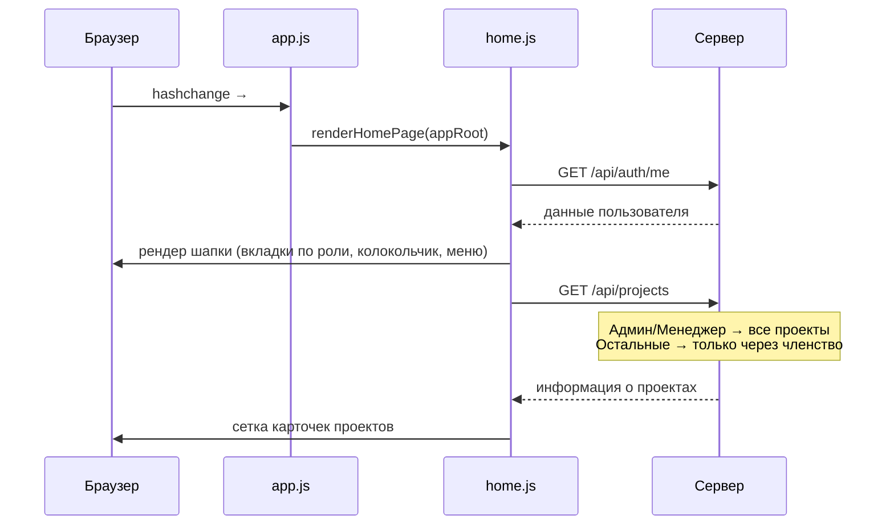

## Диаграмма потока: экран «Проекты» (#/home)

```mermaid
sequenceDiagram
  participant Браузер
  participant app.js
  participant home.js
  participant Сервер

  Браузер->>app.js: hashchange → #/home
  app.js->>home.js: renderHomePage(appRoot)

  home.js->>Сервер: GET /api/auth/me
  Сервер-->>home.js: данные пользователя

  home.js->>Браузер: рендер шапки (вкладки по роли, колокольчик, меню)

  home.js->>Сервер: GET /api/projects
  Note over Сервер: Админ/Менеджер → все проекты<br/>Остальные → только через членство
  Сервер-->>home.js: информация о проектах

  home.js->>Браузер: сетка карточек проектов
```
