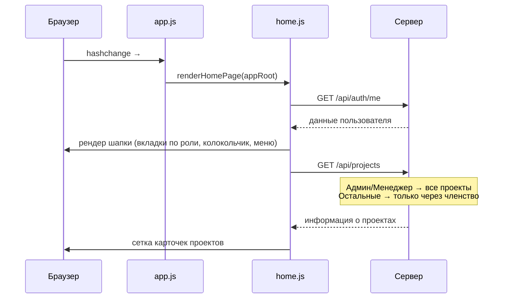
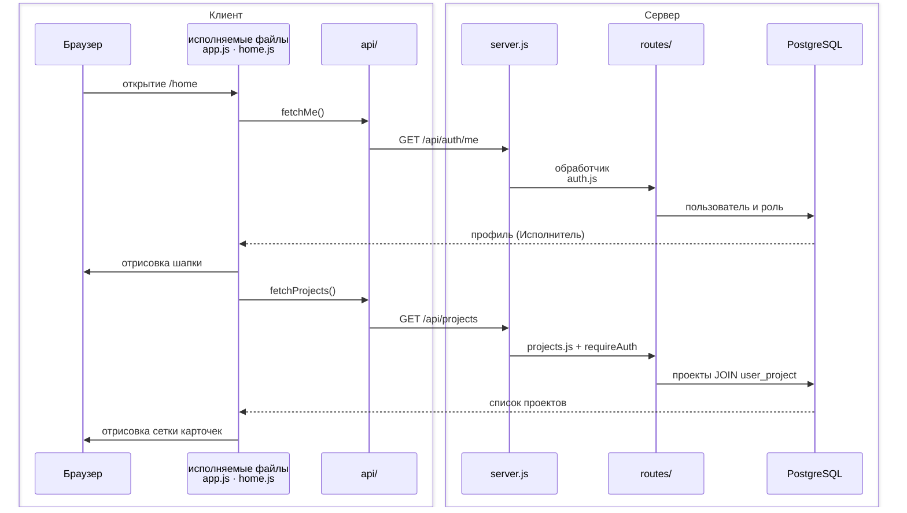

## Диаграмма потока: экран «Проекты» (#/home)

## Упрощённый поток (роль «Исполнитель»)

Для сокращения числа веток взят **Исполнитель**: нет колокольчика уведомлений, карточки «Новый проект» и списка всех проектов — только проекты с активным членством в `user_project`. Поиск по названию остаётся на клиенте, без отдельного запроса.

